# Facebook 新商业主页自动化 PRD

## 1. 背景与目标

当前扩展已经支持把 WhatsApp 号码绑定到 Facebook 商业主页。新增“新商业主页”功能后，用户可以从扩展侧边栏发起一个独立自动化脚本：先从当前商业主页切换回其所属个人主页，再进入个人公共主页列表，创建一个新的 Facebook 公共主页，并把创建后的主页 URL 记录下来。

本功能只用于用户已经登录、且有权限管理相关 Facebook 账号的场景。脚本不会绕过 Facebook 登录、验证、风控、权限限制或平台策略；遇到登录、权限、验证码、风控或页面结构变化时，需要停止并输出明确日志。

## 2. 用户入口

在扩展侧边栏的操作按钮区新增“新商业主页”按钮，位置与现有“开始绑定”“设置MX52”等按钮同级。

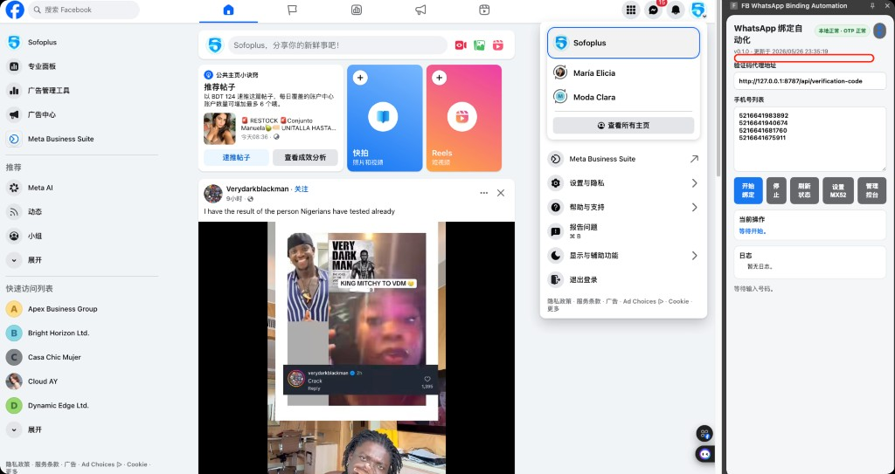

点击后启动一次性创建流程。该流程不进入 WhatsApp 号码绑定队列，也不影响正在展示的历史绑定记录。

## 3. 主页名称数据源

创建公共主页的名称来自“商户管理表”。当前仓库尚未接入真实商户表，因此先定义接口契约，具体数据库、表格或 API 后续接入时只替换数据源适配器。

```ts
export type MerchantPageName = {
  pageName: string;
  merchantId?: string;
};

export type MerchantPageSource = {
  getNextPageName(): Promise<MerchantPageName>;
  markPageCreated(input: {
    pageName: string;
    pageUrl: string;
    createdAt: string;
    merchantId?: string;
  }): Promise<void>;
};
```

在真实数据源未配置前，脚本必须失败在创建前，提示“商户管理表数据源未配置”，不能创建空名称主页。

## 4. 核心流程

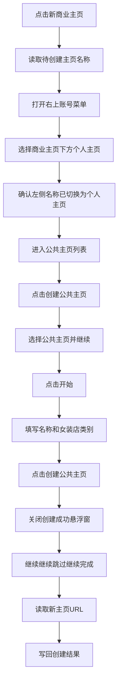

## 5. 详细步骤与贴图

### 5.1 选择当前商业主页所属个人主页

脚本点击右上角账号入口，在当前商业主页名称下方读取第一个个人主页名称并点击切换。图中 `Dynamic Edge Ltd.` 为当前商业主页，下面的 `María Elicia` 为所属个人主页。

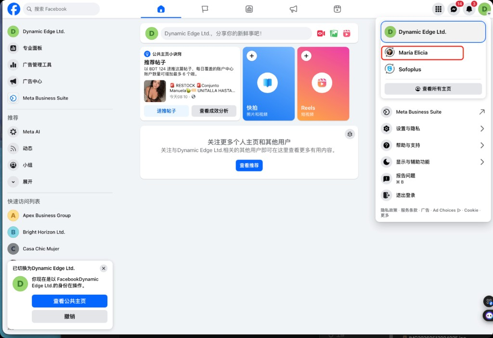

切换后需要确认页面左侧头像区域展示的名称已经变为个人主页名称，才算进入成功。

### 5.2 进入个人公共主页列表

优先使用方案 B：直接跳转到固定地址。

```text
https://www.facebook.com/pages/?category=your_pages&ref=bookmarks
```

方案 A 作为备用路径：先点击左侧“展开”，再点击“公共主页”。

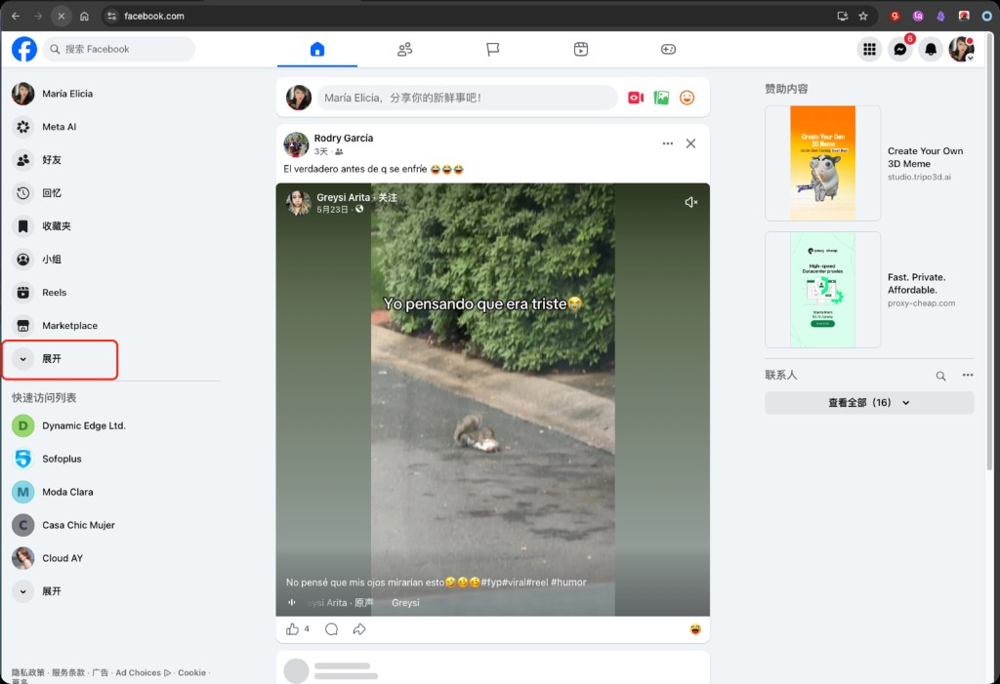

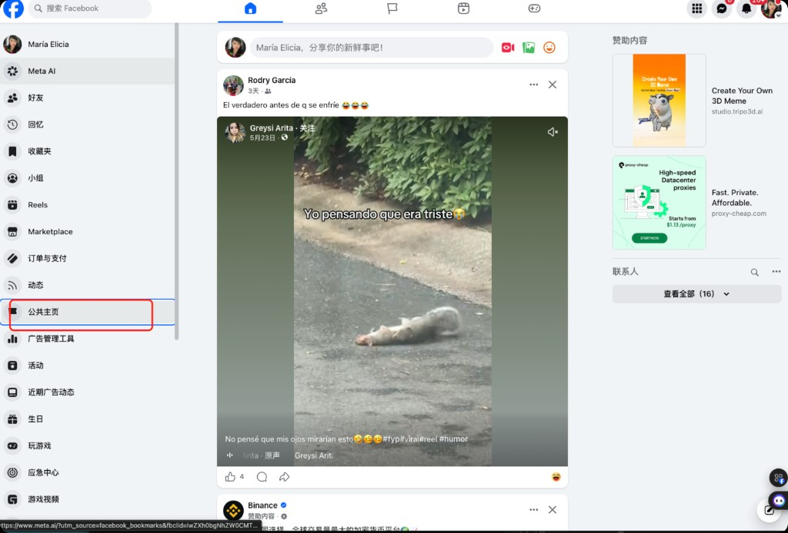

### 5.3 创建公共主页

进入公共主页列表后，点击左侧“+ 创建公共主页”。

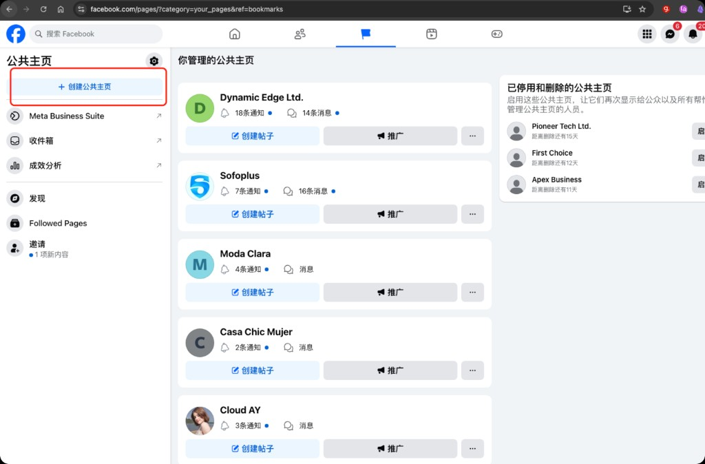

在弹窗中选择“公共主页”，再点击“继续”。

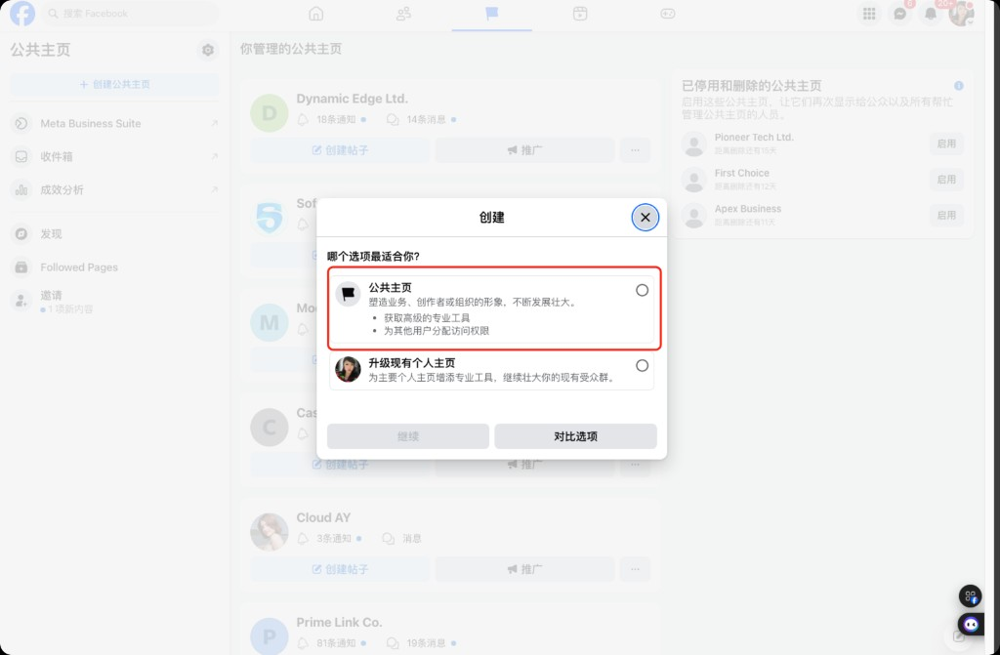

下一个弹窗点击“开始”。

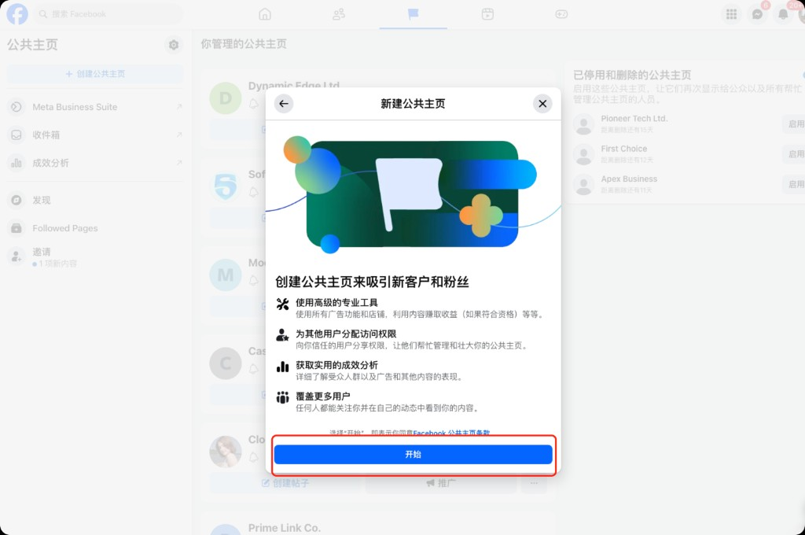

### 5.4 填写必填项

创建页面中只填写必填字段：

- 公共主页名称：读取商户管理表返回的 `pageName`。
- 类别：输入“女装店”，并从候选列表选择“女装店”。

其他字段保持为空。

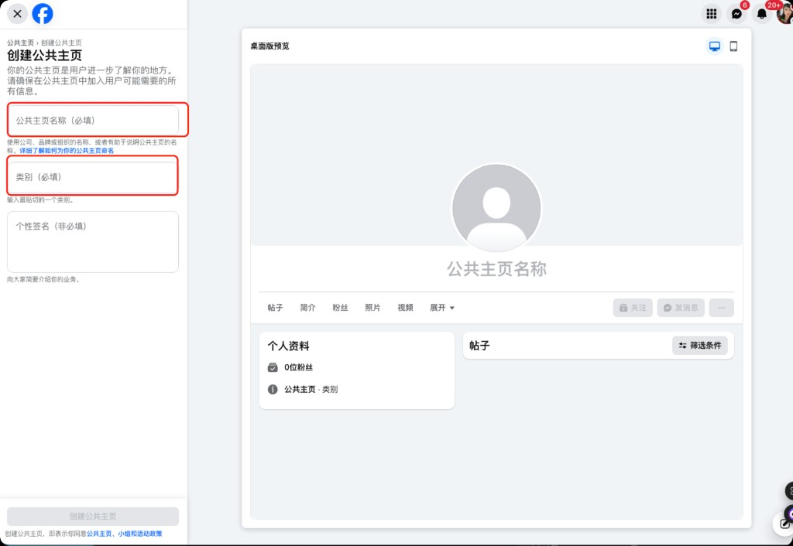

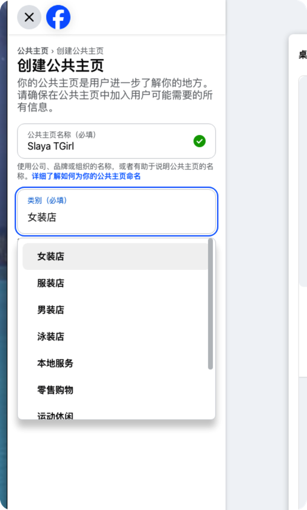

填写完成后点击“创建公共主页”。

### 5.5 关闭悬浮窗并跳过补充设置

创建成功后，关闭左下角黑色悬浮提示中的 `x`。

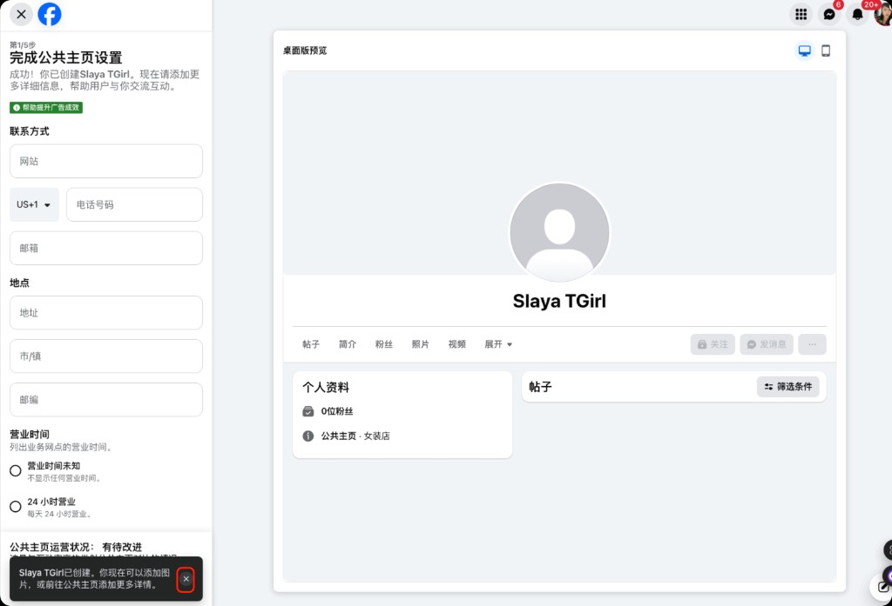

随后在第 1/5 到 5/5 的设置流程中，不填写任何信息，只按同一位置依次点击：

1. 继续
2. 继续
3. 跳过
4. 继续
5. 完成

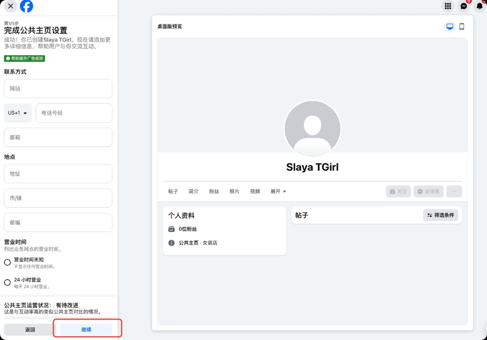

### 5.6 完成与 URL 记录

看到新公共主页页面后，读取当前地址栏 URL，例如：

```text
https://www.facebook.com/profile.php?id=61590089355062
```

该 URL 作为创建结果写回商户管理表数据源。

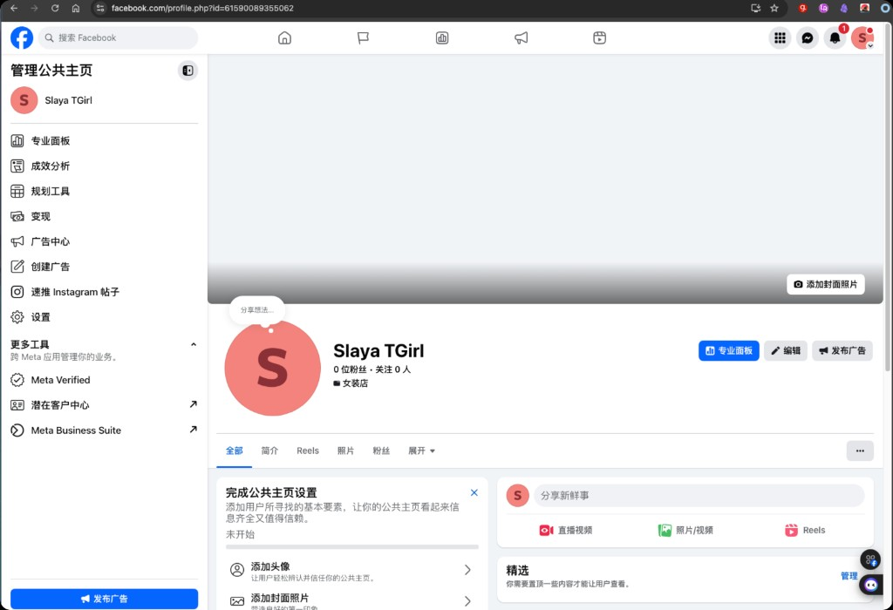

## 6. DOM 定位策略

脚本优先使用稳定、语义化的定位方式：

- 按可见文本定位按钮：`新商业主页`、`创建公共主页`、`公共主页`、`继续`、`开始`、`跳过`、`完成`。
- 按输入框标签、placeholder 或当前焦点定位“公共主页名称”和“类别”。
- 按账号菜单中的当前选中项和相邻候选项读取个人主页名称。
- 避免依赖 Facebook 动态 class 名。
- 每一步都需要等待页面元素出现，并在超时后返回明确错误。

## 7. 状态与日志

扩展需要在“当前操作”和日志区域展示关键步骤：

- 正在读取商户管理表主页名称。
- 正在选择个人主页。
- 已进入个人主页。
- 正在进入公共主页列表。
- 正在创建公共主页。
- 正在填写主页名称和类别。
- 正在跳过补充设置。
- 创建完成：`<pageUrl>`。

失败日志必须包含失败步骤和原因，不能继续执行后续步骤。

## 8. 失败处理

以下情况需要停止：

- 商户管理表未配置或返回空名称。
- 未找到当前商业主页下方的个人主页。
- 切换个人主页后左侧名称未匹配。
- 无法进入公共主页列表。
- 找不到“创建公共主页”入口。
- 类别候选中没有“女装店”。
- “创建公共主页”按钮不可点击。
- 补充设置按钮序列不符合预期。
- 完成后没有得到 `facebook.com/profile.php?id=` URL。
- Facebook 展示登录、验证、权限或风控页面。

## 9. 验收标准

- 扩展侧边栏出现“新商业主页”按钮。
- 点击按钮后，在商户表未配置时不会创建主页，并输出明确错误。
- 数据源接入后，脚本能按图 2 到图 12 的流程创建主页。
- 创建时只填写名称和“女装店”类别，其他信息为空。
- 创建完成后能记录 `profile.php?id=` URL。
- 单元测试覆盖 UI 触发、background 编排、content 路由和 DOM 自动化核心步骤。
