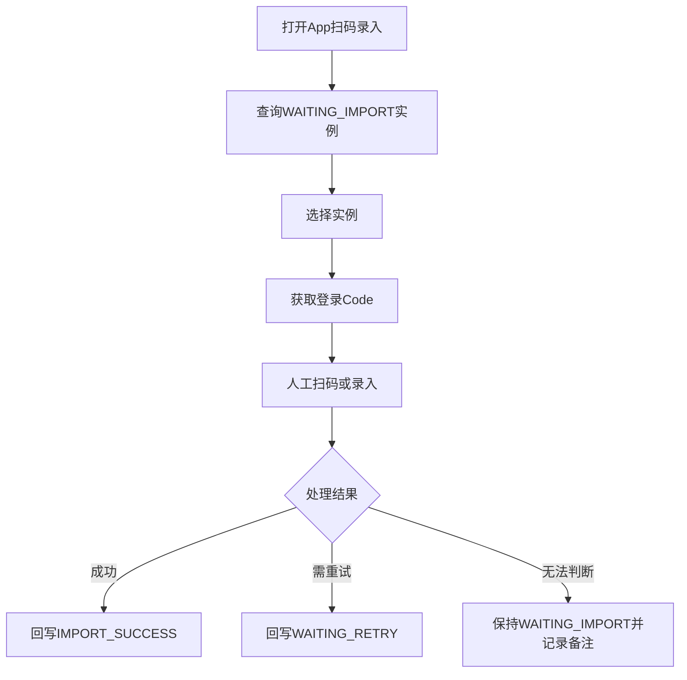

# WaRPA App 扫码录入与登录 Code 工作台 PRD

## 1. 背景与目标

WaRPA 服务端除了 FB 绑定队列，还提供待 App 扫码绑定实例查询、登录 Code 获取、App 扫码绑定状态回写能力。这些接口对应 WhatsApp 实例导入和配对阶段，发生在 FB 页面绑定之前。

本 PRD 目标是在管理控台中新增一个独立工作台，帮助操作人员查看待 App 扫码录入的实例，按 `jid` 或 `instanceId` 获取登录 Code，并在扫码或录入完成后回写 `IMPORT_SUCCESS` 或 `WAITING_RETRY`。

## 2. 用户价值

- 把 WhatsApp 实例导入状态从线下人工记录迁移到可视化工作台。
- 操作人员可以按实例获取登录 Code，减少来回查接口成本。
- 扫码或录入完成后及时回写服务端状态，后续 FB 绑定队列才能稳定领取已导入实例。
- 失败实例可写回 `WAITING_RETRY`，便于后续重新处理。

## 3. 范围

包含：

- 管理控台新增“App扫码录入”视图。
- 查询 `/pending-scan-bind-list` 展示 `WAITING_IMPORT` 实例。
- 按 `jid` 或 `instanceId` 调用 `/login-code` 获取登录 Code。
- 操作人员确认扫码或录入成功后，调用 `/app-scan-bind-status` 写 `IMPORT_SUCCESS`。
- 操作人员标记需重试时，调用 `/app-scan-bind-status` 写 `WAITING_RETRY`。
- 操作日志写入本地管理留档。

不包含：

- 自动扫码。
- 自动注册 WhatsApp 账号。
- 自动处理 WhatsApp 风控、二次验证或设备安全校验。
- 和 FB 页面绑定流程混在同一个自动执行队列里。

## 4. 相关接口

查询待 App 扫码绑定实例：

```text
POST /api/v1/incubation/wa-msg/pending-scan-bind-list
```

请求参数示例：

```json
{
  "page": 1,
  "pageSize": 10,
  "type": "CAT",
  "tenantId": 1001,
  "instanceId": "instance-id",
  "jid": "521xxxx",
  "owner": "owner",
  "proxyIp": "1.2.3.4",
  "status": "QRCODE",
  "routeLineId": 1
}
```

获取登录 Code：

```text
POST /api/v1/incubation/wa-msg/login-code
```

请求体：

```json
{
  "jid": "521xxxx",
  "instanceId": "optional-instance-id"
}
```

回写 App 扫码绑定状态：

```text
POST /api/v1/incubation/wa-msg/app-scan-bind-status
```

请求体：

```json
{
  "jid": "521xxxx",
  "status": "IMPORT_SUCCESS"
}
```

支持状态：`WAITING_IMPORT`、`IMPORT_SUCCESS`、`WAITING_RETRY`。

## 5. 业务流程



## 6. 页面需求

### 6.1 筛选区

支持筛选：

- `type`：默认 `CAT`，可选 `TIGER`。
- `tenantId`。
- `jid`。
- `instanceId`。
- `owner`。
- `proxyIp`。
- `routeLineId`。
- `status`：默认 `QRCODE`。
- 分页大小。

### 6.2 列表字段

待扫码实例表格展示：

- 序号。
- `serialNo`。
- `type`。
- `tenantId`。
- `jid`。
- `instanceId`。
- `status`。
- `importStatus`。
- `fbBindStatus`。
- `proxyIp`。
- `routeLineName` 或 `routeLineCode`。
- 最近操作。

### 6.3 行内操作

每行提供：

- `获取登录Code`：调用本地代理包装的 `/login-code`。
- `标记录入成功`：调用 `/app-scan-bind-status` 写 `IMPORT_SUCCESS`。
- `标记稍后重试`：调用 `/app-scan-bind-status` 写 `WAITING_RETRY`。
- `复制jid`。
- `复制instanceId`。

### 6.4 登录 Code 展示

获取成功后展示：

- `instanceId`。
- `code`。
- `error`。
- 获取时间。

如果响应 `error = No available account`，展示明确失败原因，不自动重试。

## 7. 本地代理需求

建议新增：

- `POST /api/warpa/pending-scan-bind-list`
- `POST /api/warpa/login-code`
- `POST /api/warpa/app-scan-bind-status`

本地代理继续统一处理：

- 网关密钥注入。
- `BaseResponse<T>` 解包。
- 远端错误转为可读本地错误。
- 请求参数校验。

## 8. 状态规则

- 只有用户点击“标记录入成功”后才写 `IMPORT_SUCCESS`。
- 用户点击“标记稍后重试”后写 `WAITING_RETRY`。
- 获取登录 Code 失败不自动改变 `importStatus`。
- 用户关闭页面或刷新页面不改变服务端状态。
- 如果回写失败，页面展示失败原因，并允许用户再次点击。

## 9. 日志与审计

每次操作写入本地操作日志：

- 查询待扫码实例。
- 获取登录 Code 成功或失败。
- 回写 `IMPORT_SUCCESS`。
- 回写 `WAITING_RETRY`。
- 回写失败原因。

日志不得展示网关密钥，不得记录完整请求头。

## 10. 异常处理

- 待扫码列表为空：展示“暂无待 App 扫码录入实例”。
- `jid` 和 `instanceId` 都缺失：禁用获取登录 Code 操作。
- 登录 Code 返回空：展示接口返回的 `error` 或“未获取到登录 Code”。
- 回写状态接口失败：保留当前行状态，展示错误并允许重试。
- 远端服务不可达：不影响其他管理控台视图。

## 11. 验收标准

- 管理控台新增 `App扫码录入` 视图。
- 用户可以查询待扫码实例列表。
- 用户可以对单个实例获取登录 Code。
- 用户可以将实例标记为 `IMPORT_SUCCESS`。
- 用户可以将实例标记为 `WAITING_RETRY`。
- 获取 Code 失败不会自动改服务端状态。
- 所有操作都有本地日志。
- 测试覆盖列表查询、登录 Code 展示、状态回写、回写失败和空状态。

## 12. 待确认

- 登录 Code 是否有过期时间，页面是否需要倒计时。
- `WAITING_RETRY` 是否会重新进入 `/pending-scan-bind-list`。
- 是否需要对批量 `IMPORT_SUCCESS` 做二次确认。
