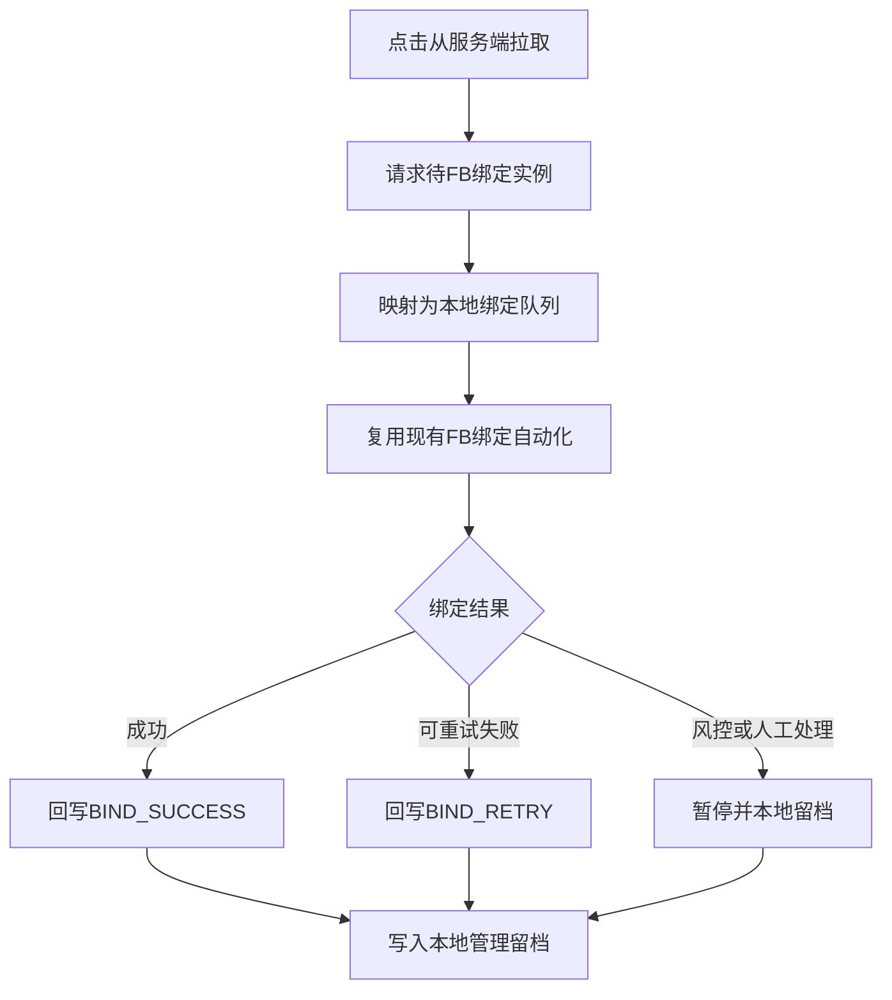

# WaRPA 待 FB 绑定队列与状态回写 PRD

## 1. 背景与目标

当前扩展的 FB WhatsApp 绑定流程依赖用户在 Side Panel 手动粘贴手机号列表。服务端新增的 `WaRPAController` 接口已经提供待 FB 绑定实例查询能力，可以通过 `/pending-fb-bind-list` 获取 `fbBindStatus = WAITING_BIND` 的 WhatsApp 实例，并通过 `/fb-bind-status` 回写绑定结果。

本 PRD 目标是把当前“本地输入号码”的执行方式升级为“从服务端待办池拉取实例、自动执行绑定、回写服务端状态”的闭环，同时保留现有手工粘贴模式作为备用入口。

## 2. 用户价值

- 减少人工复制号码和漏绑、重绑风险。
- 服务端统一管理待 FB 绑定实例。
- 绑定成功后及时写回 `BIND_SUCCESS`，避免重复下发。
- 绑定失败后写回可重试状态，并在本地管理控台保留详细失败原因。

## 3. 范围

包含：

- 本地 Node 代理新增 WaRPA 远端接口封装。
- Side Panel 新增“从服务端拉取待绑定实例”入口。
- 将 `/pending-fb-bind-list` 的实例记录映射为现有绑定队列。
- 绑定成功后调用 `/fb-bind-status` 写 `BIND_SUCCESS`。
- 最终失败或可重试失败后按策略调用 `/fb-bind-status` 写 `BIND_RETRY`。
- 绑定记录中保留 `instanceId`、`jid`、`serialNo`、`tenantId`、`type`、`proxyIp`、`routeLineId` 等服务端字段。

不包含：

- 自动创建 WhatsApp 账号。
- 自动处理 Facebook 登录、验证码、安全验证或风控挑战。
- 多浏览器并发任务锁定。
- 修改远端 WaRPA 服务端接口定义。
- 替代现有商户主页创建流程。

## 4. 相关接口

查询待 FB 绑定实例：

```text
POST /api/v1/incubation/wa-msg/pending-fb-bind-list
```

主要参数：

```json
{
  "page": 1,
  "pageSize": 10,
  "type": "CAT",
  "tenantId": 1001,
  "instanceId": "instance-id",
  "jid": "521xxxx",
  "owner": "owner",
  "proxyIp": "1.2.3.4",
  "status": "QRCODE",
  "routeLineId": 1
}
```

关键响应字段：

```json
{
  "instanceId": "instance-id",
  "jid": "521xxxx",
  "type": "CAT",
  "serialNo": "SN001",
  "importStatus": "IMPORT_SUCCESS",
  "fbBindStatus": "WAITING_BIND",
  "proxyIp": "1.2.3.4"
}
```

回写 FB 绑定状态：

```text
POST /api/v1/incubation/wa-msg/fb-bind-status
```

请求体：

```json
{
  "jid": "521xxxx",
  "status": "BIND_SUCCESS"
}
```

支持状态：`WAITING_BIND`、`BIND_SUCCESS`、`BIND_RETRY`。

## 5. 业务流程



## 6. 功能需求

### 6.1 本地 WaRPA 代理客户端

新增 `server/waRpaClient.ts`，统一处理：

- Base URL：`/api/v1/incubation/wa-msg`。
- 所有远端请求使用 `POST` 和 `application/json`。
- 自动附加 `X-Incubation-Gateway-Key`。
- 解析 `BaseResponse<T>`，只向扩展返回 `data` 和必要错误信息。
- 远端非 2xx、`code` 非成功或 JSON 异常时，返回可读错误。

### 6.2 本地代理接口

建议新增：

- `POST /api/warpa/pending-fb-bind-list`
- `POST /api/warpa/fb-bind-status`

扩展只调用本地代理，不能在扩展源码、日志或文档中出现真实网关密钥。

### 6.3 队列生成

从服务端实例生成 `BindingRecord` 时：

- `jid` 作为号码来源，最终 OTP 查询使用现有 `formatOtpLookupPhone` 规则。
- `countryCode` 默认沿用 `MX+52`。
- `businessPageName` 仍由当前 Facebook 页面确认得到。
- `instanceId`、`serialNo`、`tenantId`、`waType`、`proxyIp` 等字段作为可选扩展字段写入记录。
- 空 `jid`、重复 `jid`、`fbBindStatus` 不是 `WAITING_BIND` 的记录不得进入队列。

### 6.4 状态回写策略

建议映射：

- 页面绑定成功并确认列表号码存在：写 `BIND_SUCCESS`。
- OTP 超时、验证码错误超过重试、普通 DOM 自动化失败：写 `BIND_RETRY`。
- 设备未连接：写 `BIND_RETRY`，并本地标记 `disconnected`。
- Facebook 登录、权限、风控、安全验证、商户主页不可绑定：暂停队列，只本地留档，暂不回写服务端，避免污染服务端重试池。
- 回写失败时，本地记录必须保留 `serverWritebackFailed` 信息，并提示人工复核。

### 6.5 执行入口

Side Panel 保留现有“开始绑定”手工模式，新增服务端模式：

- 用户可选择 `CAT` 或 `TIGER`。
- 用户可填写可选筛选：`tenantId`、`routeLineId`、`owner`、`proxyIp`。
- 用户可设置本次拉取数量上限，默认 10。
- 拉取成功后展示“已从服务端拉取 N 条待绑定实例”，再进入现有绑定流程。

## 7. 数据记录

`BindingRecord` 建议新增可选字段：

```ts
type WarpaBindingFields = {
  instanceId?: string;
  jid?: string;
  waType?: "CAT" | "TIGER";
  serialNo?: string;
  tenantId?: string | number;
  proxyIp?: string;
  routeLineId?: string | number;
  serverFbBindStatus?: "WAITING_BIND" | "BIND_SUCCESS" | "BIND_RETRY";
  serverWritebackAt?: string;
  serverWritebackError?: string;
};
```

## 8. 异常处理

- 服务端待绑定列表为空：不启动队列，提示“暂无待 FB 绑定实例”。
- 远端接口不可达：不启动队列，提示 HTTP 状态和简短错误。
- 网关密钥缺失：本地代理返回“服务端未配置 INCUBATION_GATEWAY_KEY”。
- 回写失败：不回滚本地成功记录，但将该记录标记为“本地成功、服务端回写失败”。
- 队列中途停止：不主动写 `BIND_RETRY`，保持服务端原状态。

## 9. 验收标准

- 用户可以从 Side Panel 拉取服务端待 FB 绑定实例并生成队列。
- 拉取请求支持 `type`、分页和数量限制。
- 手工粘贴模式仍可使用。
- 绑定成功后远端收到 `/fb-bind-status`，状态为 `BIND_SUCCESS`。
- 可重试失败后远端收到 `/fb-bind-status`，状态为 `BIND_RETRY`。
- 风控、权限、登录、安全验证类异常只暂停并本地留档。
- 管理控台可以看到实例服务端字段和回写结果。
- 测试覆盖 WaRPA 客户端解析、队列映射、状态回写策略和回写失败处理。

## 10. 待确认

- `BIND_RETRY` 是否适合承载所有非成功失败，还是需要远端新增永久失败状态。
- 是否允许多执行端同时拉取同一批 `WAITING_BIND` 实例。
- `jid` 是否总是可直接转换为当前 Facebook 绑定页需要的手机号。
