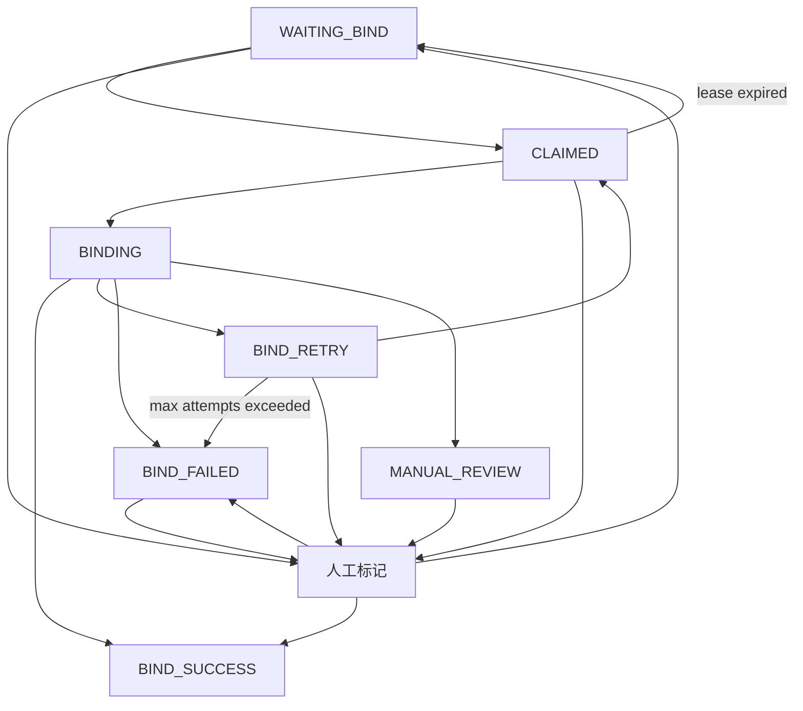
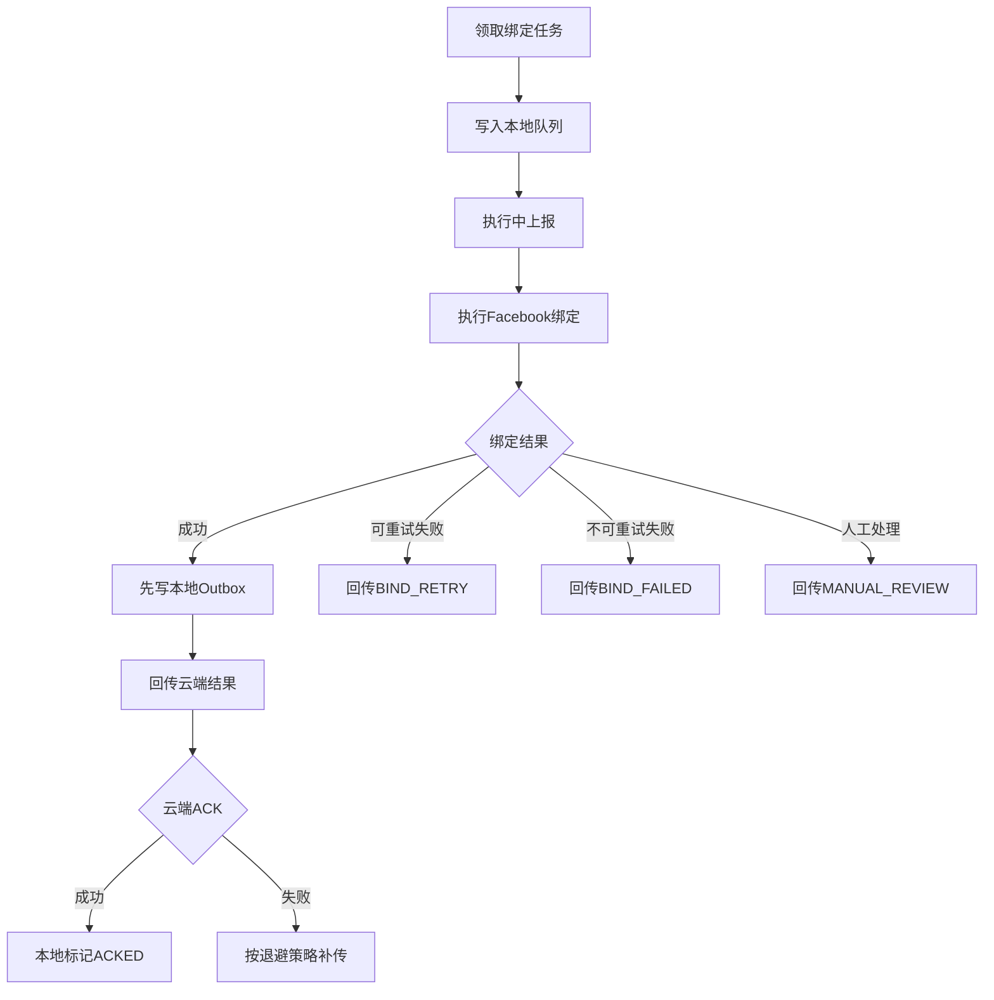

# FB 绑定自动化服务端协同 PRD

## 1. 背景与目标

当前自动化工具已经可以通过 WaRPA 接口获取待 FB 绑定的 WhatsApp 账号，并通过状态接口回写 `BIND_SUCCESS` 或 `BIND_RETRY`。现有接口能支撑基础闭环，但在更高自动化程度下仍存在几个风险：

- 待绑定列表偏查询语义，缺少明确的任务领取和超时失败机制，多执行端并发时可能重复处理同一手机号。
- 回写接口偏状态更新，无法完整表达本地绑定结果，例如 FB 账号、个人主页、公共主页、失败步骤和失败原因。
- 本地绑定成功后，如果云端临时不可用，缺少可恢复的本地补偿机制，存在“本地已成功、云端未同步”的状态不一致风险。
- 失败状态只有 `BIND_RETRY`，服务端难以区分可重试失败、不可重试失败和需要人工处理的风控/权限问题。

本 PRD 目标是把 FB 绑定流程升级为“服务端任务池领取、本地自动绑定、结果可靠回传、服务端幂等落库”的完整协同链路。

## 2. 范围

包含：

- CWA/WaRPA 服务端保留并增强现有 FB 绑定查询与回写接口。
- 服务端增加任务认领锁定、10 分钟无上报失败判定和重试锁定机制。
- 服务端扩展 FB 绑定任务状态、失败原因和执行过程字段。
- 本地执行端回传完整绑定结果，包括 `phone`、`FacebookId`、个人主页 ID、公共主页 ID 等。
- 本地执行端通过 outbox 保证绑定结果最终同步到云端。
- 服务端通过幂等键保证重复回传不会产生重复写入或错误状态迁移。

不包含：

- 自动登录 Facebook。
- 绕过 Facebook、WhatsApp 或 Meta 的安全验证、权限限制和风控策略。
- 自动创建 WhatsApp 账号。
- 自动创建 Facebook 个人账号。
- 修改验证码服务的验证码识别逻辑。

## 3. 现有接口现状

当前接口文档中已有以下能力：

- `POST /api/v1/incubation/wa-msg/pending-fb-bind-list`：查询 `fbBindStatus = WAITING_BIND` 的待 FB 绑定实例。
- `POST /api/v1/incubation/wa-msg/fb-bind-status`：按 `jid` 回写 `fbBindStatus`，并支持写入 `fbPageName` 和 `fbPageId`。

现有接口建议保留，并在兼容旧客户端的前提下增强：

- `/pending-fb-bind-list` 保留为查询接口，用于后台列表、人工排查和兼容旧客户端。
- `/pending-fb-bind-list` 在新客户端传入 `workerId` 时进入领取模式，由 CWA 云端写入认领锁定并返回任务字段。
- `/fb-bind-status` 保留为兼容接口，同时增强为完整结果回传、执行中上报和人工判定入口。
- 本期不新增 `/fb-bind-task/*` 接口，避免服务端和客户端同时维护两套 API。

## 4. 用户价值

- 执行端可以连续领取任务并自动绑定，减少人工复制手机号和漏绑风险。
- 服务端可以控制任务分发、重试次数和并发领取，避免重复绑定同一号码。
- 绑定成功后可以沉淀完整 FB 与 WA 关联数据，便于后续审计、运营和问题排查。
- 本地成功但云端失败时，系统可以自动补传，减少人工核对成本。
- 失败原因结构化后，服务端可以自动决定重试、终止或转人工。

## 5. 角色与术语

- `任务`：一个待绑定的 WA 账号与目标 FB 主页的绑定工作单元。
- `执行端`：运行 Chrome 扩展和本地代理的机器或浏览器实例。
- `workerId`：执行端稳定标识，用于服务端记录任务由谁领取。
- `taskId`：绑定任务唯一 ID，后续执行上报、结果回传、状态查询都使用该 ID。
- `认领锁定`：服务端下发任务后给执行端的独占处理窗口，默认 10 分钟；窗口内任务不应被其他执行端领取。
- `重试锁定`：任务失败后由云端设置的再次下发等待时间，按失败次数递增。
- `outbox`：本地持久化待同步事件队列，用于保证云端临时失败时仍可补传。
- `idempotencyKey`：幂等键，用于保证同一结果重复上报时只产生一次业务影响。

## 6. 服务端任务状态

建议将 `fbBindStatus` 从三态扩展为以下状态：

- `WAITING_BIND`：未领取，等待绑定。
- `CLAIMED`：已被执行端领取，认领锁定窗口内处理中，但尚未开始页面绑定。
- `BINDING`：执行端已经开始在 Facebook 页面执行绑定。
- `BIND_SUCCESS`：绑定成功，终态。
- `BIND_RETRY`：可重试失败，等待后续再次领取。
- `BIND_FAILED`：不可重试失败，终态或需人工复核后重新打开。
- `MANUAL_REVIEW`：权限、风控、安全验证、主页不匹配等需要人工处理。

建议状态流转：



状态约束：

- `BIND_SUCCESS` 默认不可被自动覆盖。
- `BIND_SUCCESS`、`BIND_FAILED` 属于自动化终态，但管理后台可以通过人工标记修正历史结果。
- `MANUAL_REVIEW` 不应自动重试，需要人工判断后选择“成功”或“失败”，也可以在确认仍需自动化处理时重置回 `WAITING_BIND`。
- 过期任务、失败任务、人工复核任务和待处理任务都允许由具备权限的后台用户手动标记为 `BIND_SUCCESS`、`BIND_FAILED` 或 `WAITING_BIND`。
- 人工标记必须记录操作人、操作时间、原状态、新状态、原因备注；如果标记为成功，需要补全可确认的 `phone`、`facebookId`、`personalProfileId`、`fbPageId`、`fbPageName`。
- 任务认领后 10 分钟内没有任何 `/fb-bind-status` 上报，服务端可判定本次执行失败，写入 `BIND_RETRY` 并进入重试锁定。

## 7. 现有接口增强建议

### 7.1 `/pending-fb-bind-list` 增强为查询兼领取接口

保留现有接口路径：

```text
POST /api/v1/incubation/wa-msg/pending-fb-bind-list
```

兼容策略：

- 旧客户端不传 `workerId` 时，接口保持原查询语义，只返回待绑定列表，不写认领锁定。
- 新自动化客户端传入 `workerId` 时，接口进入领取模式。服务端返回任务前原子写入 `claimedBy`、`claimedAt`、`claimExpiresAt`，避免多端重复领取。
- 服务端可通过网关 Key、客户端版本、`workerId` 或显式 `claimMode = true` 判断是否进入领取模式；建议优先使用 `workerId` + `claimMode`，避免后台查询误触发领取。

请求参数：

```json
{
  "workerId": "chrome-extension-device-001",
  "claimMode": true,
  "type": "FIVE_SEGMENT",
  "tenantId": 1001,
  "routeLineId": 1,
  "capabilities": ["facebook_linked_whatsapp", "otp_auto_fetch"]
}
```

参数说明：

- `workerId`：必填，执行端稳定标识。
- `claimMode`：新客户端建议传 `true`，表示本次请求要领取任务；旧查询方不传。
- `type`：可选，账号类型，支持 `CAT`、`TIGER`、`FIVE_SEGMENT`。
- `tenantId`：可选，租户筛选。
- `routeLineId`：可选，线路筛选。
- `capabilities`：可选，执行端能力声明，用于后续按能力分发任务。

认领锁定时长不由执行端传入，统一由 CWA 云端决定。默认规则为：任务下发到 Chrome 执行端后，如果 10 分钟内没有任何 `/fb-bind-status` 上报，服务端判定本次执行失败，并按重试锁定策略延迟再次下发。

响应数据：

```json
{
  "claimExpiresAt": 1780300000000,
  "record": {
    "taskId": "fb_bind_task_123",
    "id": 1,
    "tenantId": 1001,
    "type": "FIVE_SEGMENT",
    "instanceId": "instance-id",
    "jid": "521xxxx",
    "phone": "521xxxx",
    "otpLookupPhone": "521xxxx",
    "countryCode": "MX+52",
    "serialNo": "SN001",
    "fbBindStatus": "CLAIMED",
    "attemptCount": 1,
    "maxAttemptCount": 3,
    "lastErrorCode": null,
    "lastErrorMessage": null,
    "lastFailedAt": null,
    "proxyIp": "1.2.3.4",
    "routeLineId": 1,
    "routeLineName": "线路 A",
    "routeLineCode": "route-a",
    "priority": 100,
    "businessPageExpectedName": "Page Name",
    "fbPageBindingTarget": {
      "fbPageId": "123456789",
      "fbPageName": "Page Name"
    },
    "claimedBy": "chrome-extension-device-001",
    "claimedAt": 1780299100000,
    "claimExpiresAt": 1780300000000,
    "retryLockedUntil": null
  }
}
```

领取规则：

- 服务端只下发 `WAITING_BIND` 和符合重试条件的 `BIND_RETRY` 任务，且任务不在 `retryLockedUntil` 锁定期内。
- 领取模式每次只返回 1 个号码；无需批次概念，也不需要 `claimId`。
- 服务端下发任务时应原子更新认领锁定，避免并发执行端拿到同一任务。
- `claimExpiresAt` 前，同一任务不能再次被其他 `workerId` 领取。
- `claimExpiresAt` 到期且没有任何 `/fb-bind-status` 上报时，服务端判定为执行端失联或未处理，写入 `BIND_RETRY`、`errorCode = CLAIM_TIMEOUT`，并设置下一次 `retryLockedUntil`。
- 任务排序建议按 `priority desc`、`lastFailedAt asc`、`createdAt asc`。

### 7.2 `/fb-bind-status` 增强为执行中上报接口

保留现有接口路径：

```text
POST /api/v1/incubation/wa-msg/fb-bind-status
```

请求参数：

```json
{
  "action": "PROGRESS",
  "workerId": "chrome-extension-device-001",
  "taskId": "fb_bind_task_123",
  "jid": "521xxxx",
  "status": "BINDING",
  "currentStep": "WAITING_OTP"
}
```

响应数据：

```json
{
  "taskId": "fb_bind_task_123",
  "accepted": true,
  "status": "BINDING",
  "claimExpiresAt": 1780300000000
}
```

执行步骤建议：

- `CLAIMED`
- `OPEN_FACEBOOK_PAGE`
- `CHECK_BUSINESS_PAGE`
- `FILL_PHONE`
- `WAITING_OTP`
- `SUBMIT_CODE`
- `VERIFY_RESULT`
- `REPORTING_RESULT`

规则：

- 执行中上报只允许当前认领持有者提交。
- 执行中上报不做复杂续租；服务端只记录任务仍在推进、最近一次 `currentStep` 和 `lastReportedAt`。
- 只要 10 分钟内收到任意有效 `/fb-bind-status` 上报，服务端就不应按 `CLAIM_TIMEOUT` 判定失败。
- 如果执行中上报已超过 `claimExpiresAt`，服务端可以拒绝该上报，或接受后要求执行端尽快提交最终 `RESULT`，具体策略由 CWA 云端统一决定。
- 旧客户端不传 `action`、`taskId` 时，仍按原简单状态回写逻辑处理。

### 7.3 `/fb-bind-status` 增强为完整结果回传接口

保留现有接口路径：

```text
POST /api/v1/incubation/wa-msg/fb-bind-status
```

请求参数：

```json
{
  "action": "RESULT",
  "idempotencyKey": "fb_bind_task_123:BIND_SUCCESS:local_event_001",
  "eventId": "local_event_001",
  "taskId": "fb_bind_task_123",
  "workerId": "chrome-extension-device-001",
  "workerVersion": "1.3.0",
  "type": "FIVE_SEGMENT",
  "tenantId": 1001,
  "instanceId": "instance-id",
  "serialNo": "SN001",
  "phone": "521xxxx",
  "jid": "521xxxx",
  "status": "BIND_SUCCESS",
  "facebookId": "1000123456789",
  "facebookAccountName": "Operator Name",
  "personalProfileId": "1000123456789",
  "personalProfileUrl": "https://www.facebook.com/profile.php?id=1000123456789",
  "fbPageId": "123456789",
  "fbPageName": "Page Name",
  "fbPageUrl": "https://www.facebook.com/PageName",
  "businessManagerId": "987654321",
  "bindRequestedAt": "2026-06-01T08:00:00.000Z",
  "codeReceivedAt": "2026-06-01T08:00:25.000Z",
  "bindFinishedAt": "2026-06-01T08:00:40.000Z",
  "attemptCount": 1,
  "durationMs": 40000,
  "failedStep": null,
  "errorCode": null,
  "errorMessage": null,
  "retryable": false,
  "evidence": {
    "pageUrl": "https://www.facebook.com/settings?tab=linked_whatsapp",
    "matchedPhoneOnPage": true,
    "successText": "已关联 WhatsApp"
  }
}
```

必填字段：

- 新客户端成功或失败回传：`idempotencyKey`、`eventId`、`taskId`、`workerId`。
- 旧客户端简单回写：继续支持只传 `jid`、`type`、`status`、`fbPageName`、`fbPageId`。
- `phone`
- `status`
- `bindFinishedAt`

成功结果建议字段：

- `facebookId`
- `facebookAccountName`
- `personalProfileId`
- `personalProfileUrl`
- `fbPageId`
- `fbPageName`
- `fbPageUrl`
- `businessManagerId`
- `bindRequestedAt`
- `codeReceivedAt`
- `durationMs`

失败结果建议字段：

- `failedStep`
- `errorCode`
- `errorMessage`
- `retryable`
- `attemptCount`
- `evidence.pageUrl`

响应数据：

```json
{
  "ackId": "ack_20260601_xxx",
  "taskId": "fb_bind_task_123",
  "status": "BIND_SUCCESS",
  "accepted": true,
  "duplicate": false,
  "serverUpdatedAt": 1780300040000,
  "message": "success"
}
```

重复回传响应：

```json
{
  "ackId": "ack_20260601_xxx",
  "taskId": "fb_bind_task_123",
  "status": "BIND_SUCCESS",
  "accepted": true,
  "duplicate": true,
  "serverUpdatedAt": 1780300040000,
  "message": "duplicate event accepted"
}
```

结果回传规则：

- 服务端以 `idempotencyKey` 或 `taskId + eventId` 做幂等，重复结果返回成功 ACK。
- `BIND_SUCCESS` 不应被后续 `BIND_RETRY`、`BIND_FAILED` 覆盖。
- 如果新客户端未传 `idempotencyKey`，服务端可以用 `taskId + status + bindFinishedAt` 生成弱幂等键，但应在响应中提示字段缺失。
- 旧客户端简单回写不要求完整字段，但不能覆盖已经有完整结果的 `BIND_SUCCESS`。

### 7.4 `/pending-fb-bind-list` 支持云端状态反查

保留现有接口路径：

```text
POST /api/v1/incubation/wa-msg/pending-fb-bind-list
```

请求参数：

```json
{
  "queryMode": "SYNC_STATUS",
  "workerId": "chrome-extension-device-001",
  "taskIds": ["fb_bind_task_123"],
  "idempotencyKeys": ["fb_bind_task_123:BIND_SUCCESS:local_event_001"]
}
```

响应数据：

```json
{
  "records": [
    {
      "taskId": "fb_bind_task_123",
      "idempotencyKey": "fb_bind_task_123:BIND_SUCCESS:local_event_001",
      "fbBindStatus": "BIND_SUCCESS",
      "acknowledged": true,
      "fbPageId": "123456789",
      "fbPageName": "Page Name",
      "serverUpdatedAt": 1780300040000
    }
  ]
}
```

用途：

- 本地不确定上一次回传是否成功时，先查询云端状态。
- 如果云端已是 `BIND_SUCCESS`，本地 outbox 可以直接标记为 `ACKED`。
- 如果云端未收到结果，本地继续按 outbox 重试策略补传。

### 7.5 `/fb-bind-status` 支持人工复核判定

保留现有接口路径：

```text
POST /api/v1/incubation/wa-msg/fb-bind-status
```

请求参数：

```json
{
  "action": "MANUAL_DECISION",
  "taskId": "fb_bind_task_123",
  "decision": "SUCCESS",
  "targetStatus": "BIND_SUCCESS",
  "operatorId": "admin-001",
  "fromStatus": "MANUAL_REVIEW",
  "phone": "521xxxx",
  "facebookId": "1000123456789",
  "personalProfileId": "1000123456789",
  "fbPageId": "123456789",
  "fbPageName": "Page Name",
  "remark": "人工确认 Facebook 页面已完成绑定"
}
```

人工判定规则：

- `decision = SUCCESS` 或 `targetStatus = BIND_SUCCESS`：服务端将任务置为 `BIND_SUCCESS`，并写入人工确认的 FB 账号、个人主页、公共主页等字段。
- `decision = FAILED` 或 `targetStatus = BIND_FAILED`：服务端将任务置为 `BIND_FAILED`，并记录失败原因和人工备注。
- `targetStatus = WAITING_BIND`：服务端将任务重新放回待绑定池，清理当前认领锁定和重试锁定，并保留历史失败或人工备注。
- 人工判定必须记录 `operatorId`、`decidedAt`、`fromStatus`、`targetStatus`、`remark`，用于审计。
- 人工标记不限于 `MANUAL_REVIEW`，也可用于修正过期、失败、重复领取、历史导入等任务状态。
- 人工判定入口只允许管理后台或具备后台权限的调用方使用，避免自动化客户端误写终态。

## 8. 回传字段建议

### 8.1 WA 与任务字段

- `taskId`：任务唯一 ID。
- `workerId`：执行端 ID。
- `tenantId`：租户 ID。
- `type`：账号类型。
- `instanceId`：WA 实例 ID。
- `jid`：WA JID 或手机号。
- `phone`：标准化手机号。
- `countryCode`：国家或地区代码。
- `serialNo`：导入序列号。
- `routeLineId`、`routeLineName`、`routeLineCode`：线路信息。

### 8.2 FB 绑定结果字段

- `facebookId`：执行绑定的 Facebook 账号 ID。
- `facebookAccountName`：执行绑定的 Facebook 账号名称。
- `personalProfileId`：个人主页 ID，通常可与 `facebookId` 一致，但建议单独保留。
- `personalProfileUrl`：个人主页 URL。
- `fbPageId`：绑定到的公共主页 ID。
- `fbPageName`：绑定到的公共主页名称。
- `fbPageUrl`：公共主页 URL。
- `businessManagerId`：BM ID，如页面可读取则回传。

### 8.3 执行过程字段

- `bindRequestedAt`：点击 Facebook 绑定按钮时间。
- `codeReceivedAt`：收到 OTP 验证码时间。
- `bindFinishedAt`：绑定流程结束时间。
- `durationMs`：本次绑定耗时。
- `attemptCount`：服务端任务尝试次数。
- `workerVersion`：执行端版本。
- `failedStep`：失败步骤。
- `errorCode`：结构化失败码。
- `errorMessage`：可读失败原因。
- `retryable`：本地判断是否可重试。

### 8.4 证据字段

- `pageUrl`：完成或失败时所在页面。
- `matchedPhoneOnPage`：页面是否能确认当前手机号已关联。
- `successText`：页面成功提示文案。
- `domSnapshotHash`：可选，页面快照哈希，用于排查但不直接上传敏感 DOM。

安全要求：

- 不回传 OTP 验证码明文。
- 不回传完整 Cookie、Token、请求头或网关密钥。
- 如需截图或 DOM 片段，必须先脱敏手机号、邮箱、Cookie、Token 等敏感内容。

## 9. 失败分类与重试策略

建议服务端统一 `errorCode` 枚举：

- `CLAIM_TIMEOUT`：任务下发后 10 分钟内没有任何有效上报，视为执行端未处理或失联，可重试。
- `OTP_TIMEOUT`：验证码超时，可重试。
- `OTP_INVALID`：验证码错误，可重试，但需限制次数。
- `WA_DISCONNECTED`：WA 设备未连接，可重试。
- `PHONE_INVALID`：Facebook 判定手机号无效，通常不可重试。
- `FB_PERMISSION_DENIED`：当前 FB 无主页权限，进入人工处理。
- `FB_SECURITY_CHECKPOINT`：安全验证或风控，进入人工处理。
- `FB_PAGE_MISMATCH`：当前主页不是预期绑定主页，进入人工处理。
- `PAGE_NOT_FOUND`：主页或设置页不可达，进入人工处理或稍后重试。
- `DOM_SELECTOR_FAILED`：页面结构变化，可重试，但超过阈值后需升级脚本。
- `NETWORK_ERROR`：网络错误，可重试。
- `SERVER_ERROR`：服务端错误，可重试。
- `UNKNOWN_ERROR`：未知错误，默认可重试，但受最大次数限制。

本地到服务端状态映射：

- 绑定成功并确认页面已关联当前手机号：`BIND_SUCCESS`。
- OTP 超时、WA 未连接、网络错误、普通 DOM 自动化失败：`BIND_RETRY`。
- 手机号无效、达到最大重试次数：`BIND_FAILED`。
- FB 权限不足、安全验证、主页不匹配、非商业账号：`MANUAL_REVIEW`。
- 用户手动停止任务：建议回传 `BIND_RETRY` 和 `errorCode = USER_STOPPED`；如果本地未回传，云端在 10 分钟无上报后按 `CLAIM_TIMEOUT` 处理。

服务端重试规则：

- `BIND_RETRY` 可再次进入领取池，但需受 `maxAttemptCount` 和 `retryLockedUntil` 限制。
- 重试锁定由 CWA 云端控制，建议按同一任务连续失败次数递增：第 1 次失败锁定 1 分钟，第 2 次锁定 15 分钟，第 3 次锁定 60 分钟，第 4 次锁定 1 天，第 5 次及以后锁定 2 天。
- 锁定期内任务不应被 `/pending-fb-bind-list` 领取模式下发，但可在后台列表中查询和人工标记。
- 任务被人工标记为 `WAITING_BIND` 时，可以清理 `retryLockedUntil`，立即重新进入待绑定池。
- 同一 `errorCode` 连续失败超过阈值时，可自动转 `MANUAL_REVIEW`。
- `BIND_FAILED` 和 `MANUAL_REVIEW` 默认不自动下发。
- 认领后 10 分钟内没有任何有效上报时，服务端写入 `BIND_RETRY`、`errorCode = CLAIM_TIMEOUT`，并设置下一次 `retryLockedUntil`。

## 10. 最终一致性设计

### 10.1 本地 outbox

本地一旦确认绑定成功，应先写入持久化 outbox，再调用云端回传接口。

outbox 记录建议：

```json
{
  "eventId": "local_event_001",
  "idempotencyKey": "fb_bind_task_123:BIND_SUCCESS:local_event_001",
  "taskId": "fb_bind_task_123",
  "status": "BIND_SUCCESS",
  "payload": {},
  "syncStatus": "PENDING",
  "nextRetryAt": "2026-06-01T08:01:00.000Z",
  "retryCount": 0,
  "lastError": null,
  "createdAt": "2026-06-01T08:00:40.000Z",
  "updatedAt": "2026-06-01T08:00:40.000Z"
}
```

规则：

- 本地成功不依赖云端实时可用。
- 云端回传失败时，不能丢弃成功结果。
- 扩展启动、网络恢复、用户打开 Side Panel、本地代理启动时，都应扫描待同步 outbox。
- 云端返回 ACK 后，本地将事件标记为 `ACKED`。
- 未 ACK 前，本地 UI 显示“本地已成功，云端待同步”。

### 10.2 本地补传重试

建议重试策略：

- 网络错误、请求超时、HTTP 5xx：指数退避重试，例如 10 秒、30 秒、2 分钟、5 分钟、15 分钟、1 小时。
- HTTP 429：按服务端 `Retry-After` 重试。
- HTTP 409：先通过 `/pending-fb-bind-list` 的 `queryMode = SYNC_STATUS` 查询云端状态，再决定是否补传或进入冲突处理。
- HTTP 4xx 参数错误：标记为 `FAILED_PERMANENT`，提示人工修复，不盲目重试。

### 10.3 服务端幂等

服务端应以 `idempotencyKey` 做唯一约束，也可以辅助使用 `taskId + eventId`。

规则：

- 同一个 `idempotencyKey` 重复上报，服务端返回同一个 ACK。
- 任务已是 `BIND_SUCCESS`，再次收到同一手机号、同一主页的成功结果，应返回成功 ACK。
- 同一 `taskId` 收到不同 `fbPageId` 或不同 `phone` 的成功结果时，服务端应进入 `MANUAL_REVIEW` 并返回冲突原因。
- `BIND_SUCCESS` 不应被后续 `BIND_RETRY` 覆盖。
- 服务端结果表应保留事件历史，任务主表只保存最新业务状态。

## 11. 数据模型建议

### 11.1 任务主表字段

建议在现有 WA 实例表或独立 FB 绑定任务表中维护：

- `task_id`
- `tenant_id`
- `instance_id`
- `jid`
- `phone`
- `country_code`
- `type`
- `serial_no`
- `fb_bind_status`
- `attempt_count`
- `max_attempt_count`
- `priority`
- `claimed_by`
- `claimed_at`
- `claim_expires_at`
- `retry_locked_until`
- `last_reported_at`
- `current_step`
- `last_error_code`
- `last_error_message`
- `last_failed_at`
- `fb_page_id`
- `fb_page_name`
- `facebook_id`
- `personal_profile_id`
- `bind_finished_at`
- `created_at`
- `updated_at`

### 11.2 结果事件表字段

建议单独维护结果事件表：

- `event_id`
- `idempotency_key`
- `task_id`
- `worker_id`
- `status`
- `payload_json`
- `accepted`
- `duplicate`
- `conflict_reason`
- `created_at`

这样可以保留每次回传历史，并用任务主表提供当前状态查询。

## 12. 管理后台建议

管理后台建议展示：

- 当前 `fbBindStatus`。
- 任务是否被领取、领取人、认领锁定到期时间、重试锁定到期时间。
- 当前执行步骤 `currentStep`。
- 尝试次数和最大尝试次数。
- 最近失败码和失败原因。
- 绑定成功的 `phone`、`facebookId`、`personalProfileId`、`fbPageId`、`fbPageName`。
- 最近一次回传时间和回传是否重复。
- 人工标记入口：对 `MANUAL_REVIEW`、`BIND_RETRY`、`BIND_FAILED`、认领超时和历史任务点击“成功”“失败”或“重新待绑定”，分别落到 `BIND_SUCCESS`、`BIND_FAILED` 或 `WAITING_BIND`。
- 人工标记历史：展示每次人工修改的操作人、原状态、新状态、备注和操作时间。

## 13. 核心流程



## 14. 验收标准

- 服务端支持按认领锁定领取 FB 绑定任务，同一任务在锁定窗口内不会被多端重复领取。
- 服务端支持任务下发后 10 分钟无上报自动判定失败，并能记录执行端当前步骤。
- 服务端支持 `retryLockedUntil` 重试锁定，按 1 分钟、15 分钟、60 分钟、1 天、2 天递增。
- 本地能回传成功绑定的 `phone`、`facebookId`、`personalProfileId`、`fbPageId`、`fbPageName` 和执行时间。
- 本地成功但云端回传失败时，结果进入 outbox，重启后仍能继续补传。
- 服务端对重复成功回传返回成功 ACK，保证接口幂等。
- 服务端能根据失败原因区分 `BIND_RETRY`、`BIND_FAILED` 和 `MANUAL_REVIEW`。
- 管理后台能对人工复核、失败、过期和历史任务手动标记“成功”“失败”或“重新待绑定”，并记录操作人、原状态、新状态、备注和判定时间。
- 认领超时且未收到任何上报的任务能自动进入 `BIND_RETRY` 并按重试锁定延迟释放。
- 管理后台能看到任务状态、领取人、失败原因、回传时间和绑定目标主页。

## 15. 分阶段实施建议

第一阶段：增强结果回写，兼容现有链路。

- 保留 `/pending-fb-bind-list` 和 `/fb-bind-status`。
- 在 `/fb-bind-status` 中增加 `phone`、`facebookId`、`personalProfileId`、`fbPageUrl`、`errorCode`、`errorMessage` 等可选字段。
- 本地先实现 outbox，保证简单回写失败也能补传。

第二阶段：在现有接口上引入任务领取和认领锁定。

- `/pending-fb-bind-list` 增加 `claimMode`、`workerId`，新客户端传入后进入单号码领取模式。
- `/fb-bind-status` 增加 `action = PROGRESS | RESULT`，用于执行中上报和完整结果回传。
- 服务端实现认领锁定、10 分钟无上报失败判定、重试锁定、状态机、幂等键和任务事件表。
- 本地服务端模式切换为从 `/pending-fb-bind-list` 领取任务。

第三阶段：完善运营与补偿。

- `/pending-fb-bind-list` 增加 `queryMode = SYNC_STATUS`，用于本地 outbox 反查云端 ACK 状态。
- `/fb-bind-status` 增加 `action = MANUAL_DECISION`，用于管理后台人工标记成功、失败或重新待绑定。
- 管理后台展示任务领取、10 分钟无上报失败、重试锁定、失败分类和回传事件。
- 支持人工标记 `MANUAL_REVIEW`、`BIND_RETRY`、`BIND_FAILED`、认领超时和历史任务，并保留人工操作审计。
