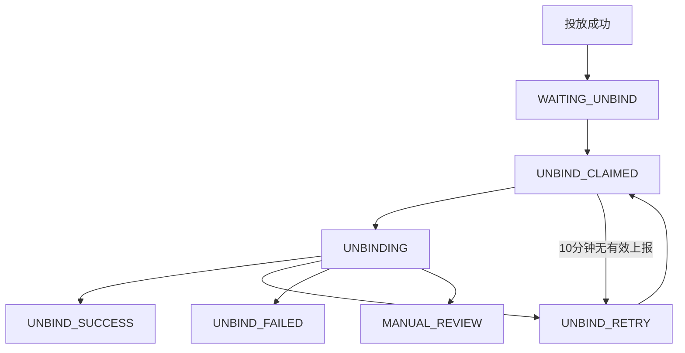

# FB 解绑自动化服务端协同 PRD

## 1. 背景与目标

阶段 3-4 中，CWA 服务端接收到投放成功数据后，需要自动把对应 WhatsApp 与 Facebook 的绑定关系标记为 `FB待解绑`。Chrome 执行端随后像自动化绑定流程一样，自动领取待解绑任务，并执行 PRA/RPA 解绑流程。

目标：

- 投放成功后，CWA 自动生成或更新 FB 解绑任务。
- Chrome 端请求待解绑任务时必须携带当前 `workId`。
- 服务端下发任务时必须返回 `phone`、关联的 `facebookId`、上一次绑定的 `workId`。
- 服务端只下发 `FB待解绑` 和符合重试条件的 `解绑重试`。
- 解绑任务的认领锁定、超时失败和重试锁定机制与 FB 绑定一致。

## 2. 范围

包含：

- CWA 投放成功后标记 `FB待解绑`。
- 服务端待解绑任务领取、锁定、回传和重试。
- Chrome 端自动领取任务并执行现有解绑流程。
- 管理后台查看解绑状态、失败原因和人工处理。

不包含：

- 投放系统内部成功判定逻辑。
- 自动登录 Facebook。
- 绕过 Facebook、WhatsApp 或 Meta 风控。
- 重写 Chrome 端 DOM 解绑能力。

## 3. 关键字段

- `workId`：当前投放任务 ID，Chrome 领取待解绑任务时必传。
- `lastBindWorkId`：该手机号上一次绑定 FB 时的 `workId`，服务端下发时必返。
- `phone`：待解绑 WhatsApp 手机号，服务端下发时必返。
- `facebookId`：上一次绑定关联的 Facebook 账号 ID，服务端下发时必返。
- `taskId`：解绑任务 ID，用于进度上报和结果回传。
- `workerId`：Chrome 执行端 ID，用于认领锁定。

## 4. 状态流转

建议新增独立字段 `fbUnbindStatus`：

| 状态 | 说明 |
| --- | --- |
| `WAITING_UNBIND` | FB 待解绑 |
| `UNBIND_CLAIMED` | 已领取，认领锁定中 |
| `UNBINDING` | Chrome 正在解绑 |
| `UNBIND_SUCCESS` | 解绑成功 |
| `UNBIND_RETRY` | 解绑重试 |
| `UNBIND_FAILED` | 解绑失败 |
| `MANUAL_REVIEW` | 需要人工复核 |



规则：

- `UNBIND_SUCCESS` 默认不可被自动覆盖。
- `UNBIND_FAILED`、`MANUAL_REVIEW` 默认不自动下发。
- `UNBIND_RETRY` 只有在 `retryLockedUntil` 到期后才可再次下发。

## 5. 核心流程

1. CWA 服务端接收到投放成功数据，读取当前 `workId` 和 `phone`。
2. 服务端按 `phone` 查询最近一次 `BIND_SUCCESS` 记录，得到 `facebookId` 和 `lastBindWorkId`。
3. 服务端创建或更新解绑任务为 `WAITING_UNBIND`。
4. Chrome 端请求待解绑任务，传入 `workerId` 和当前 `workId`。
5. 服务端只从 `WAITING_UNBIND`、符合重试条件的 `UNBIND_RETRY` 中原子领取 1 条任务。
6. Chrome 端拿到 `phone`、`facebookId`、`lastBindWorkId` 后执行 PRA/RPA 解绑。
7. Chrome 端回传进度和最终结果。
8. 服务端写入 `UNBIND_SUCCESS`、`UNBIND_RETRY`、`UNBIND_FAILED` 或 `MANUAL_REVIEW`。

投放成功事件示例：

```json
{
  "workId": "delivery_work_20260602_001",
  "phone": "521xxxx",
  "deliveryStatus": "SUCCESS",
  "deliveryFinishedAt": "2026-06-02T03:30:00.000Z"
}
```

触发约束：

- 只有 `deliveryStatus = SUCCESS` 才触发 `WAITING_UNBIND`。
- 如果 `workId + phone + facebookId` 已有解绑任务，重复事件只做幂等更新。
- 如果找不到上一次绑定关系，进入 `MANUAL_REVIEW`。

## 6. 待解绑领取接口

```text
POST /api/v1/incubation/wa-msg/pending-fb-unbind-list
```

请求：

```json
{
  "workerId": "chrome-extension-device-001",
  "claimMode": true,
  "workId": "delivery_work_20260602_001",
  "type": "FIVE_SEGMENT",
  "tenantId": 1001,
  "routeLineId": 1
}
```

响应：

```json
{
  "claimExpiresAt": 1780300000000,
  "record": {
    "taskId": "fb_unbind_task_123",
    "phone": "521xxxx",
    "facebookId": "1000123456789",
    "workId": "delivery_work_20260602_001",
    "lastBindWorkId": "bind_work_20260601_001",
    "fbUnbindStatus": "UNBIND_CLAIMED",
    "attemptCount": 1,
    "maxAttemptCount": 3,
    "claimedBy": "chrome-extension-device-001",
    "claimedAt": 1780299100000,
    "claimExpiresAt": 1780300000000,
    "retryLockedUntil": null
  }
}
```

无任务：

```json
{
  "claimExpiresAt": null,
  "record": null
}
```

下发规则：

- 每次领取只返回 1 条任务。
- 只下发 `WAITING_UNBIND` 和未锁定的 `UNBIND_RETRY`。
- 下发时原子写入 `claimedBy`、`claimedAt`、`claimExpiresAt`。
- `claimExpiresAt` 前不允许其他 `workerId` 重复领取。
- 请求的当前 `workId` 与任务 `workId` 不一致时，不下发该任务。

## 7. 解绑状态回传接口

```text
POST /api/v1/incubation/wa-msg/fb-unbind-status
```

进度上报：

```json
{
  "action": "PROGRESS",
  "workerId": "chrome-extension-device-001",
  "taskId": "fb_unbind_task_123",
  "workId": "delivery_work_20260602_001",
  "lastBindWorkId": "bind_work_20260601_001",
  "phone": "521xxxx",
  "facebookId": "1000123456789",
  "status": "UNBINDING",
  "currentStep": "CLICK_REMOVE_PHONE"
}
```

结果回传：

```json
{
  "action": "RESULT",
  "idempotencyKey": "fb_unbind_task_123:UNBIND_SUCCESS:local_event_001",
  "eventId": "local_event_001",
  "taskId": "fb_unbind_task_123",
  "workerId": "chrome-extension-device-001",
  "workId": "delivery_work_20260602_001",
  "lastBindWorkId": "bind_work_20260601_001",
  "phone": "521xxxx",
  "facebookId": "1000123456789",
  "status": "UNBIND_SUCCESS",
  "unbindFinishedAt": "2026-06-02T03:31:30.000Z",
  "failedStep": null,
  "errorCode": null,
  "errorMessage": null,
  "retryable": false
}
```

响应：

```json
{
  "ackId": "ack_20260602_xxx",
  "taskId": "fb_unbind_task_123",
  "status": "UNBIND_SUCCESS",
  "accepted": true,
  "duplicate": false,
  "serverUpdatedAt": 1780300090000
}
```

必填字段：

- `taskId`
- `workerId`
- `workId`
- `lastBindWorkId`
- `phone`
- `facebookId`
- `status`
- `idempotencyKey`，仅 `RESULT` 必填
- `eventId`，仅 `RESULT` 必填

## 8. 锁定与重试

认领锁定：

- 服务端下发任务后，默认锁定 10 分钟。
- 10 分钟内没有任何有效进度或结果上报，服务端写入 `UNBIND_RETRY` 和 `errorCode = CLAIM_TIMEOUT`。
- 10 分钟内收到有效上报，则不按认领超时处理。

重试锁定：

- `UNBIND_RETRY` 可再次进入领取池，但必须等 `retryLockedUntil` 到期。
- 重试间隔与绑定一致：第 1 次失败 1 分钟，第 2 次 15 分钟，第 3 次 60 分钟，第 4 次 1 天，第 5 次及以后 2 天。
- 达到 `maxAttemptCount` 后转 `UNBIND_FAILED` 或 `MANUAL_REVIEW`。

失败状态建议：

- 成功移除手机号：`UNBIND_SUCCESS`。
- 网络错误、服务端临时错误、普通 DOM 失败、用户停止：`UNBIND_RETRY`。
- 找不到手机号、FB 权限不足、安全验证、主页不匹配、`facebookId` 或 `workId` 冲突：`MANUAL_REVIEW`。
- 人工确认不可解绑或超过最大重试次数：`UNBIND_FAILED`。

## 9. 幂等与冲突

- 投放成功事件按 `workId + phone + facebookId` 幂等。
- 结果回传按 `idempotencyKey` 或 `taskId + eventId` 幂等。
- 同一结果重复回传时，服务端返回成功 ACK，并标记 `duplicate = true`。
- 同一 `taskId` 收到不同 `phone`、`facebookId`、`workId` 或 `lastBindWorkId` 的成功结果时，转 `MANUAL_REVIEW`。
- `UNBIND_SUCCESS` 不应被后续 `UNBIND_RETRY` 覆盖。

## 10. Chrome 端要求

- 自动轮询待解绑接口，请求时携带 `workerId` 和当前 `workId`。
- 只处理服务端返回的任务，不在本地自行构造服务端任务。
- 执行前校验 `phone`、`facebookId`、`lastBindWorkId`。
- 复用现有 PRA/RPA 解绑流程，从 Facebook 已关联 WhatsApp 列表中移除目标手机号。
- 执行过程中上报 `PROGRESS`。
- 本地成功后先写 outbox，再回传 `UNBIND_SUCCESS`。
- 云端临时不可用时，本地成功结果必须可补传。

## 11. 后台与验收

后台需要展示：

- `fbUnbindStatus`
- `workId`、`lastBindWorkId`
- `phone`、`facebookId`
- 领取人、认领锁定到期时间、重试锁定到期时间
- 当前步骤、尝试次数、最近失败原因
- 人工标记成功、失败、重新待解绑入口

验收标准：

- 投放成功后，服务端能把可确认的 FB 关系标记为 `WAITING_UNBIND`。
- Chrome 领取请求必须携带当前 `workId`。
- 服务端响应必须包含 `phone`、`facebookId`、`lastBindWorkId`。
- 服务端只下发 `WAITING_UNBIND` 和未锁定的 `UNBIND_RETRY`。
- 同一任务在认领锁定期内不会重复下发。
- 认领后 10 分钟无有效上报会进入 `UNBIND_RETRY` 并设置重试锁定。
- Chrome 成功解绑后回传 `UNBIND_SUCCESS`。
- 回传支持幂等，重复事件不会重复修改业务状态。
- 后台可查看并人工处理失败或复核任务。
