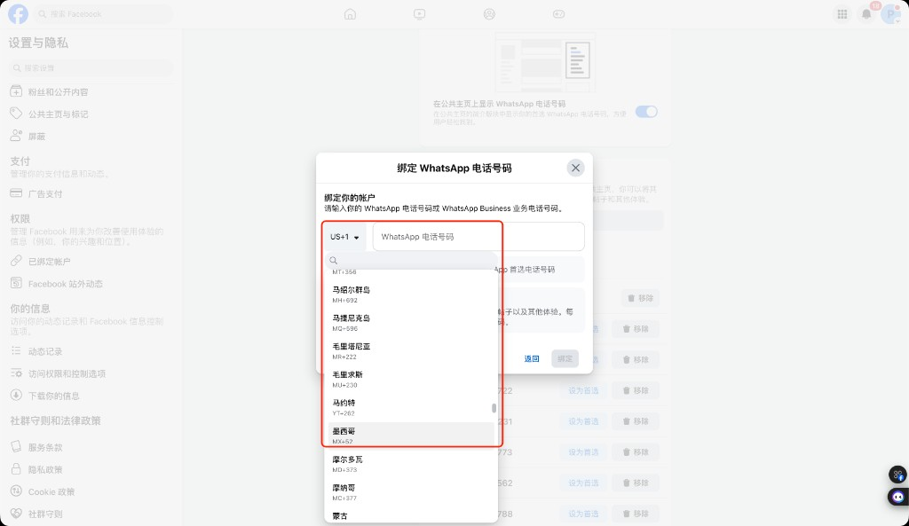
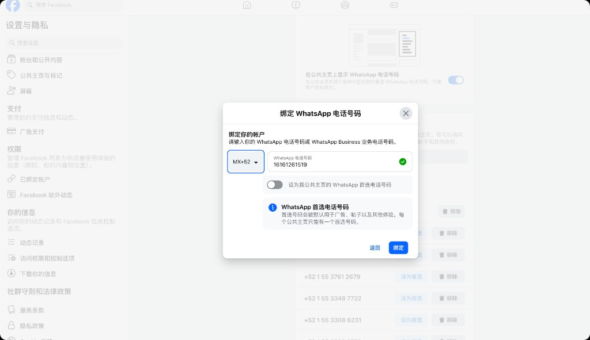
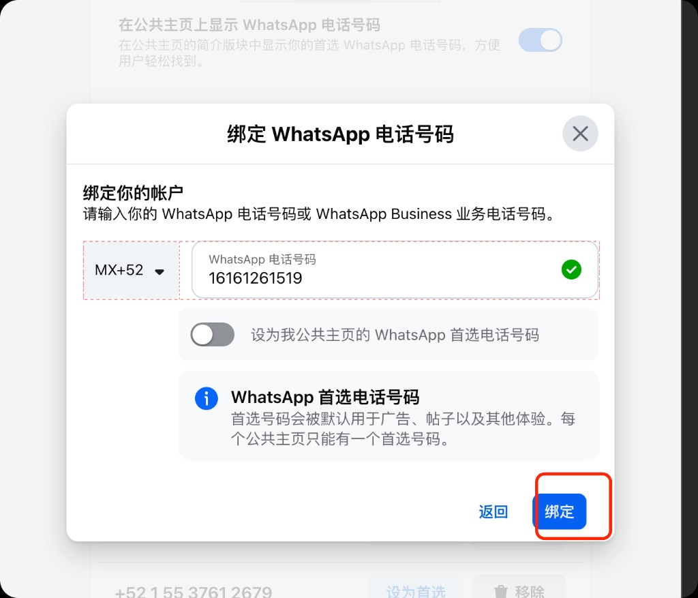
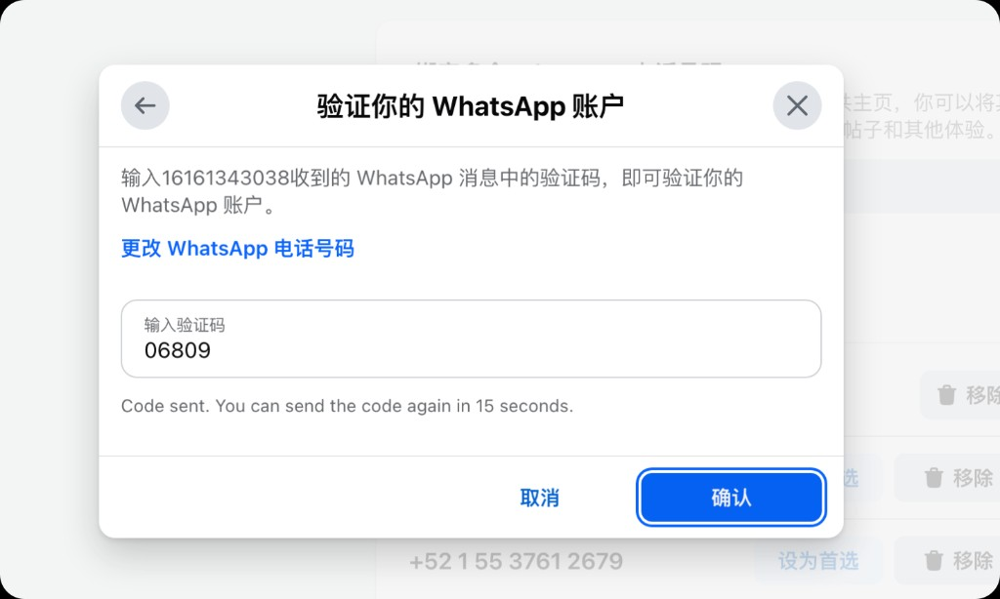
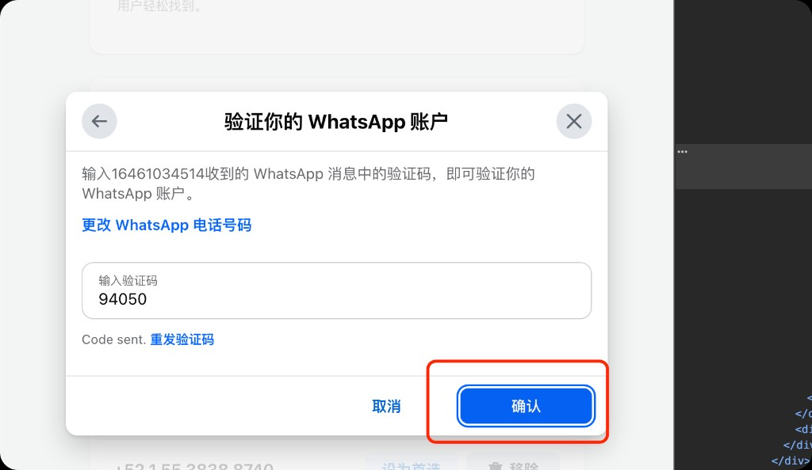
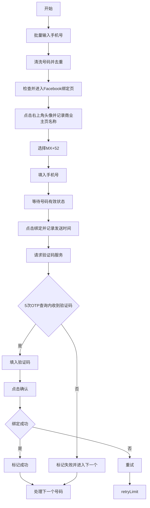

# WhatsApp 号码自动绑定到 Facebook 商业主页需求文档

## 1. 背景与目标

需要开发一个运行在 Chrome 网页端的操作自动化工具，辅助用户批量把 WhatsApp 号码绑定到 Facebook 商业主页的“已关联 WhatsApp”设置页。

工具需要模拟人工在 Facebook 页面中的操作：进入绑定页、选择国家/地区代码、填入号码、点击绑定、获取 WhatsApp 验证码、填入验证码并确认。每个号码都需要记录关键时间点和最终状态，失败时自动重试并继续处理下一个号码。

目标页面：

```text
https://www.facebook.com/settings?tab=linked_whatsapp
```

## 2. 使用范围

本工具仅用于用户有权限管理的 Facebook 商业主页，以及用户有权接收验证码的 WhatsApp 或 WhatsApp Business 号码。

本工具不负责绕过 Facebook、WhatsApp 或 Meta 的安全策略、风控策略、登录验证、验证码限制、账号权限限制或平台使用条款。页面结构、文案和风控行为可能随 Facebook 更新而变化，因此工具需要具备可配置选择器、失败日志和可观测状态。

## 3. 用户输入

用户启动任务前，需要在工具界面中批量输入待绑定手机号列表。

输入要求：

- 支持多行粘贴，每行一个号码。
- 支持从混合文本中识别号码，自动去除空格、横线、括号等分隔符。
- 默认国家/地区代码为 `MX+52`，手机号本体不包含 `+52` 前缀时按墨西哥号码处理。
- 号码去重后进入执行队列。
- 每条队列记录包含：商业主页名称、手机号、国家/地区代码、状态、是否成功、尝试次数、绑定请求时间、验证码接收时间、验证码、错误原因。

状态枚举：

| 状态 | 说明 |
| --- | --- |
| `pending` | 等待处理 |
| `binding_requested` | 已点击“绑定”，等待验证码 |
| `code_received` | 已收到验证码 |
| `verifying` | 正在填入验证码并确认 |
| `success` | 绑定成功 |
| `failed` | 达到重试上限或出现不可恢复错误 |
| `skipped` | 用户手动跳过 |

## 4. 页面与贴图说明

### 图 1：国家/地区代码选择

页面弹窗中需要把国家/地区代码切换为 `MX+52`。实现时可通过点击下拉菜单并选择墨西哥，也可以在可控情况下通过 DOM 事件设置选择结果，但必须触发 Facebook 页面实际监听的输入、点击或变更事件。



### 图 2：手机号输入后校验有效

国家/地区代码为 `MX+52` 后，工具需要把当前队列中的号码填入 `WhatsApp 电话号码` 输入框，并等待页面出现有效校验状态。



### 图 3：点击“绑定”

手机号有效后，工具点击弹窗右下角的“绑定”按钮。点击后需要在本地记录当前手机号和绑定请求时间。



### 图 4：输入验证码并确认

工具从验证码服务获取到 5 位验证码后，填入验证码输入框，并点击“确认”。



### 图 5：确认按钮位置

验证码确认弹窗中需要点击右下角的蓝色“确认”按钮。



## 5. 核心业务流程



## 6. 功能需求

### 6.1 批量号码识别

工具启动后先询问用户输入待绑定手机号列表。用户批量粘贴后，工具自动识别号码并生成队列。

号码清洗规则：

- 去除空格、制表符、横线、括号。
- 支持识别 `+52`、`52`、`MX+52` 前缀。
- 最终填入 Facebook 输入框时，只填手机号本体，国家/地区代码由下拉框设置为 `MX+52`。
- 对重复号码只保留第一条，并在结果中提示重复数量。

### 6.2 页面进入与校验

工具需要判断当前 Chrome 标签页是否已经进入：

```text
https://www.facebook.com/settings?tab=linked_whatsapp
```

处理规则：

- 如果当前页面不是目标地址，自动跳转到目标地址。
- 如果未登录 Facebook 或页面显示登录页，暂停任务并提示用户手动登录。
- 如果没有主页管理权限、弹窗无法打开、页面语言变化导致选择器失效，需要标记当前任务为 `failed`，并记录错误原因。

### 6.2.1 当前商业主页确认

每次开始执行绑定队列前，工具必须先点击页面右上角头像或账号入口，读取当前选中的 Facebook 商业主页名称，并在继续绑定前记录下来。

确认规则：

- 优先读取头像菜单顶部当前主页卡片中的名称，例如截图中的 `Prime Link Co.`。
- 读取到的名称作为本批次默认 `businessPageName`，写入每条手机号的绑定关系记录。
- 绑定关系的最小记录字段为：商业主页名称、手机号、是否成功、尝试次数。
- 如果无法读取商业主页名称，或读取结果为空，必须暂停绑定流程并提示用户人工确认，不能继续点击“绑定”。
- 商业主页名称仅在每次点击“开始绑定”后确认一次；队列执行过程中不反复打开头像菜单读取名称。
- 如果用户需要切换主页，应先停止当前队列，切换后重新点击“开始绑定”，新队列会重新读取并记录新的 `businessPageName`。

### 6.3 国家/地区代码设置

目标国家/地区代码固定为 `MX+52`。

推荐定位策略：

- 优先通过可访问性属性定位国家/地区代码按钮，例如 `aria-label` 包含“国家/地区代码”或当前值。
- 点击下拉框后，按可见文本查找“墨西哥”或 `MX+52` 选项。
- 避免依赖 Facebook 动态 class 名，例如 `x1i10hfl`、`xggy1nq` 等，因为这些 class 可能随构建变化。

参考 DOM 特征：

```html
<div aria-expanded="true" aria-haspopup="menu" aria-label="国家/地区代码，MX+52" role="button" tabindex="0">
  <span dir="auto">MX+52</span>
</div>
```

### 6.4 手机号填写

手机号输入框可优先通过以下特征定位：

- `autocomplete="tel"`
- `type="text"`
- 占位或标签文本为 `WhatsApp 电话号码`
- 关联的可见 label 文本为 `WhatsApp 电话号码`

填写要求：

- 输入前清空已有值。
- 使用真实输入事件写入号码，触发 `input`、`change`、`blur` 等页面监听。
- 等待页面出现“输入WhatsApp 电话号码有效。”或同等有效状态后，才允许点击“绑定”。

参考 DOM 特征：

```html
<input
  dir="ltr"
  autocomplete="tel"
  type="text"
  value="16161261519"
/>
```

### 6.5 点击绑定与本地记录

点击“绑定”按钮后，本地记录：

- 商业主页名称。
- 手机号。
- 国家/地区代码。
- 绑定请求时间。
- 当前尝试次数。
- 当前页面 URL。
- 操作结果状态。

号码完成后，需要保存一条绑定关系记录，用于后续核对绑定结果：

```json
{
  "businessPageName": "Prime Link Co.",
  "phone": "16161261519",
  "success": true,
  "attemptCount": 1
}
```

记录建议使用 `IndexedDB`；如果第一版只需要简单可用，也可以使用 `chrome.storage.local`。

### 6.6 验证码获取

点击“绑定”后，请求服务端接口获取 WhatsApp 验证码。

接口信息：

```text
POST http://luna.mx.incubation.cloudun.ai/api/v1/incubation/wa-msg/device/verification-code
Content-Type: application/json; charset=utf-8
X-Incubation-Gateway-Key: 从安全配置读取
```

请求体：

```json
{
  "phone": "<当前手机号>"
}
```

安全要求：

- 不应在 Chrome 扩展前端代码中硬编码 `X-Incubation-Gateway-Key` 的实际值。
- 推荐由后端代理服务保存密钥，Chrome 扩展只调用代理接口，例如 `POST /api/verification-code`。
- 后端代理负责添加 `X-Incubation-Gateway-Key` 并转发到验证码服务。
- 文档、日志和 UI 中不得展示完整密钥。

验证码处理规则：

- 接收到验证码后，本地记录验证码和接收时间。
- 请求验证码后先等待 5 秒再向 OTP 服务后端查询，之后每 15 秒查询一次，最多查询 5 次。
- 每次查询前需要记录可读日志，例如 `1/5 次请求 OTP，5 秒后查询验证码服务`、`5/5 次请求 OTP，15 秒后查询验证码服务`，实际发起请求时记录 `正在第 N/5 次请求 OTP`。
- 如果 5 次查询仍未收到验证码，当前号码标记为 `failed`，关闭当前弹窗回到号码列表页，并进入下一个号码。
- 5 次 OTP 查询期间不得再次点击 Facebook 页面中的“绑定”按钮。

### 6.7 填写验证码并确认

验证码输入框可优先通过以下特征定位：

- `inputmode="numeric"`
- `maxlength="5"`
- `autocomplete="off"`
- 可见 label 或 placeholder 为“输入验证码”

参考 DOM 特征：

```html
<input
  dir="ltr"
  autocomplete="off"
  inputmode="numeric"
  maxlength="5"
  type="text"
  value=""
/>
```

填写要求：

- 只填入 5 位数字验证码。
- 触发真实输入事件。
- 点击右下角“确认”按钮。
- 如果页面提示验证码错误、过期、网络异常或仍停留在验证弹窗，则执行重试逻辑。

## 7. 异常与重试规则

| 场景 | 处理方式 |
| --- | --- |
| 未登录 Facebook | 暂停队列，提示用户登录后继续 |
| 目标页面打不开 | 当前号码标记失败，记录页面错误 |
| 国家/地区代码无法选择 | 当前号码标记失败，记录选择器错误 |
| 手机号被判定无效 | 当前号码标记失败，进入下一个 |
| 点击绑定后 5 次 OTP 查询仍无验证码 | 当前号码标记失败，关闭弹窗回到号码列表页，进入下一个 |
| 验证码错误或确认失败 | 重试，最多 2 次 |
| 重试 2 次仍失败 | 标记失败，进入下一个号码 |
| 出现“添加 WhatsApp 按钮”“发布包含 WhatsApp 按钮的帖子”“创建 WhatsApp 广告”等引导弹窗 | 视为无关紧要的非阻塞弹窗，优先点击“跳过”，没有“跳过”时点击“取消”或关闭/返回，不标记失败，不改变当前号码状态 |
| 页面出现风控、权限或安全验证 | 暂停任务，提示人工处理 |

## 8. 日志与数据记录

每条手机号至少记录以下字段：

```json
{
  "businessPageName": "Prime Link Co.",
  "phone": "16161261519",
  "countryCode": "MX+52",
  "status": "success",
  "success": true,
  "attemptCount": 1,
  "bindRequestedAt": "2026-05-26T11:00:00.000Z",
  "codeReceivedAt": "2026-05-26T11:00:20.000Z",
  "verificationCode": "06809",
  "lastError": "",
  "pageUrl": "https://www.facebook.com/settings?tab=linked_whatsapp"
}
```

日志要求：

- 支持在工具 UI 中查看每个号码的状态。
- 支持在工具 UI 顶部展示“当前操作”，用于说明扩展正在执行的具体动作。
- 支持展示最近操作日志，至少保留最近 100 条，方便判断卡在哪一步。
- 操作日志需要包含时间、级别、手机号和可读消息。
- content script 执行 DOM 操作时，必须上报“正在查找”“正在点击”“正在输入”“正在等待”等细粒度动作。
- background 等待验证码时，必须展示 OTP 查询序号和等待倒计时，例如 `1/5 次请求 OTP，5 秒后查询验证码服务`、`正在第 1/5 次请求 OTP`。
- 支持导出 CSV 或 JSON。
- 失败记录必须包含可读错误原因。
- 密钥、完整请求头等敏感信息不得写入日志。

操作日志示例：

```json
{
  "id": "2026-05-26T12:14:00.000Z-16161261519",
  "time": "2026-05-26T12:14:00.000Z",
  "level": "info",
  "phone": "16161261519",
  "message": "正在查找“绑定”按钮"
}
```

## 9. 技术方案确认

推荐采用 `Chrome Extension Manifest V3 + 后端验证码代理`。

### 9.1 Chrome 扩展模块

| 模块 | 职责 |
| --- | --- |
| `side panel` 常驻侧边栏 | 批量输入手机号、开始/暂停任务、展示当前操作、最近日志和队列状态；点击网页其他区域时不自动消失 |
| `content script` | 操作 Facebook DOM：选择国家代码、填号码、点击按钮、填验证码，并回传细粒度操作进度 |
| `background service worker` | 队列调度、计时、调用验证码代理、状态持久化、写入当前操作和操作日志 |
| `storage` | 保存任务队列、执行记录、失败原因、当前操作和最近操作日志 |

### 9.2 后端验证码代理

后端代理负责保护验证码服务密钥。


代理接口建议：

```text
POST /api/verification-code
Content-Type: application/json
```

请求体：

```json
{
  "phone": "16161261519"
}
```

代理服务内部读取环境变量：

```text
INCUBATION_GATEWAY_KEY=<实际密钥>
```

然后向真实服务发起请求：

```text
POST http://luna.mx.incubation.cloudun.ai/api/v1/incubation/wa-msg/device/verification-code
X-Incubation-Gateway-Key: <从环境变量读取>
```

### 9.3 DOM 自动化策略

选择器优先级：

1. 可访问性属性：`aria-label`、`role`、可见文本。
2. 表单语义属性：`autocomplete="tel"`、`inputmode="numeric"`、`maxlength="5"`。
3. 文案匹配：`WhatsApp 电话号码`、`绑定`、`确认`、`输入验证码`。
4. 最后才使用局部 DOM 结构，不依赖动态 class。

输入策略：

- 使用原生 setter 写入 input value。
- 派发 `input`、`change`、`blur` 事件。
- 必要时使用真实点击和键盘事件模拟用户行为。

### 9.4 推荐方案结论

确认推荐方案为：

```text
Chrome Extension Manifest V3 + Content Script DOM 自动化 + Background 队列调度 + 后端验证码代理
```

该方案最符合“Chrome 网页端操作自动化脚本工具”的目标，并且能兼顾浏览器端操作能力、批量任务管理、日志持久化和接口密钥安全。

### 9.5 常驻插件界面

扩展界面必须采用 Chrome Side Panel，而不是 `action popup`。

原因：

- `action popup` 在用户点击网页、按钮或切换焦点后会自动关闭，不适合持续展示批量任务状态。
- Side Panel 会常驻在浏览器侧边栏，用户可以一边操作 Facebook 页面，一边查看当前操作、最近日志和队列状态。
- 扩展图标点击后应打开 Side Panel，Side Panel 内复用手机号输入、代理地址、当前操作和最近日志 UI。

Manifest 要求：

```json
{
  "permissions": ["sidePanel", "storage", "tabs", "scripting"],
  "side_panel": {
    "default_path": "popup.html"
  },
  "action": {
    "default_title": "WhatsApp 绑定自动化"
  }
}
```

验收要求：

- 点击扩展图标后打开常驻侧边栏。
- 用户点击 Facebook 页面或其他按钮时，插件界面不会自动关闭。
- 当前操作、最近日志和队列状态在侧边栏内持续可见。

## 10. 非目标范围

第一版不包含以下能力：

- 自动登录 Facebook。
- 自动处理 Facebook 安全验证、二次验证、验证码或风控挑战。
- 自动创建 Facebook 商业主页。
- 自动创建或注册 WhatsApp 号码。
- 多账号并发执行。
- 绕过平台限制或异常风控。

## 11. 验收标准

第一版交付后，应满足以下验收标准：

- 用户可以批量粘贴手机号，工具能识别、清洗、去重并生成任务队列。
- 工具能判断并进入 `https://www.facebook.com/settings?tab=linked_whatsapp`。
- 工具能在执行绑定前点击右上角头像入口，读取并记录当前商业主页名称。
- 工具能自动选择 `MX+52`。
- 工具能自动填写当前手机号，并等待页面有效校验。
- 工具能点击“绑定”，并记录手机号与绑定请求时间。
- 工具能请求验证码代理接口，并记录验证码接收时间。
- 5 次 OTP 查询仍未收到验证码时，工具能标记当前号码失败并继续下一个号码。
- OTP 查询期间同一手机号不会再次点击 Facebook “绑定”按钮。
- 工具能自动填写 5 位验证码并点击“确认”。
- 工具能记录商业主页名称、手机号、是否成功、尝试次数、错误原因和关键时间点。
- 工具能实时展示当前正在执行的具体操作。
- 工具能展示最近操作日志，帮助用户判断当前卡在查找按钮、点击按钮、等待验证码还是提交验证码。
- 工具界面采用 Chrome Side Panel 常驻侧边栏，点击网页其他区域不会自动消失。
- 工具不在前端代码、文档或日志中暴露完整接口密钥。

## 12. 后续实施建议

建议分三步实现：

1. 实现最小可用 Chrome 扩展：输入手机号、操作页面、手动填验证码验证 DOM 自动化稳定性。
2. 接入验证码代理：完成自动请求验证码、填验证码、确认绑定和重试逻辑。
3. 增强可观测性：增加任务日志导出、选择器配置、失败截图或页面快照，便于后续维护 Facebook 页面变化。
